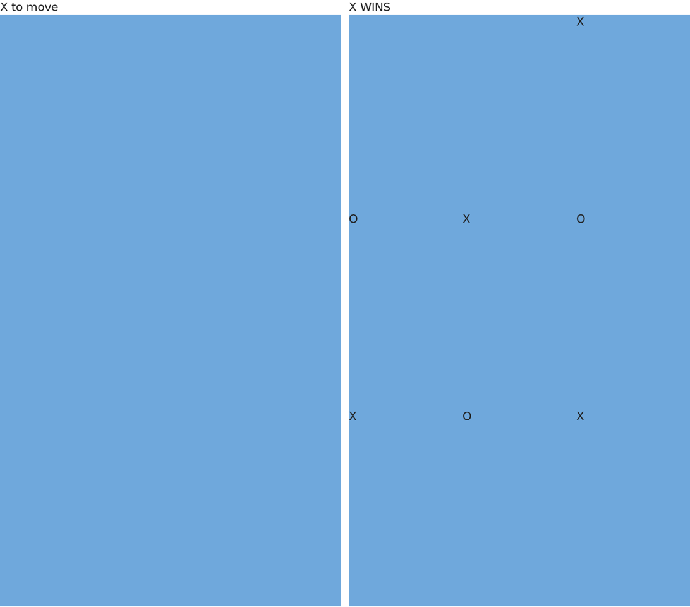
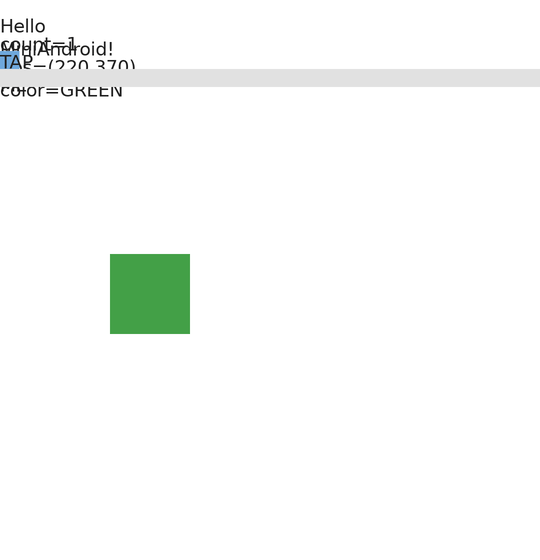
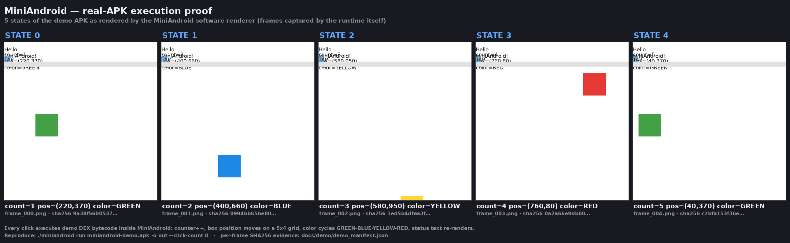

# MiniAndroid — a from-scratch Android APK Compatibility Runtime

**Current Release:** `v0.0.2 — Australorp` (real-APK execution proof, 2026-09-04)
**Previous:** `v0.0.1 — Brahma` (first public release, 2026-09-03)
**Repository:** https://github.com/Sh-TB/MiniAndroid-Compatibility-Runtime (master, not a fork)
**License:** MIT

---

## Current Release

**`v0.0.2 — Australorp`** is the **proof release**: it ships the first
end-to-end, visually verifiable demonstration that MiniAndroid executes a
real APK — install, lifecycle, DEX bytecode, view rendering, user
interaction, state change, and screenshot capture — with per-frame SHA256
evidence, a deterministic replay check, and an animated GIF assembled only
from runtime-produced frames (see [docs/demo/EVIDENCE.md](docs/demo/EVIDENCE.md)
and the `demo/` directory).

### ONE COMPLETE APK: interactive Tic-Tac-Toe (§ golden)

A real APK built with the stock toolchain (ECJ → D8, real `Outer$Inner`
listener classes, no mocks) plays a full game through the runtime:
programmatic View tree → weighted measure/layout → text/glyph rendering →
9 click dispatches through real DEX bytecode → X/O state machine with win
detection → deterministic replay.



*Left: launch frame, status "X to move". Right: after 7 dispatched clicks
X completes the anti-diagonal — status "X WINS". Both frames are produced
by the MiniAndroid framebuffer; SHA-256 of the exact PNGs:
board_launch.png `0d339d847f91d6a3…`, board_x_wins.png `284f1c9e47ef2b59…`.*

Reproduce:
```bash
bash miniandroid/tests/fixtures/tictactoe_golden/validate_tictactoe_golden.sh \
    miniandroid/build/miniandroid
# → TICTACTOE-GOLDEN VALIDATION: ALL PASS
#   9/9 clicks dispatched · turn alternation · X WINS · glyph ink localized
#   per cell · frames 7/8/9 byte-identical (frozen game) · 10-frame replay
#   byte-identical across independent runs
```

### The proof, in one look

REAL APK → DEX EXECUTION → ANDROID RUNTIME → UI → STATE CHANGE → SCREENSHOT



*The animation above is assembled ONLY from frames captured by the
MiniAndroid runtime while executing the demo APK (`demo/`, MIT). Every
click dispatches through real DEX bytecode: the counter increments, the box
moves on a 5x4 grid, its color cycles, and the status text re-renders.*

Static fallback / closer look — STATE 0 → STATE 4 of the same run:



*Reproduce it yourself (command also shipped inside the release artifact):*
```bash
# interaction-driven: 8 clicks, 9 frames
./run-miniandroid.sh run miniandroid-demo.apk -o proof --click-count 8
# time-driven: the app animates ITSELF through its own postDelayed ticker
# (zero injected clicks — the runtime only advances Looper time)
./run-miniandroid.sh run miniandroid-demo.apk -o proof --frames 8
# -> proof/frames/frame_000..00N.png + proof/frames/manifest.json (per-frame SHA256)
```
*Two runs produce byte-identical frames (deterministic software renderer).
Frame provenance rules: [docs/demo/EVIDENCE.md](docs/demo/EVIDENCE.md).*

Release naming convention: codenames for meaningful releases are chosen by
the project owner (v0.0.1 — Brahma, v0.0.2 — Australorp). Small bugfix and
maintenance releases reuse the previous name or carry none; contributors
and automation must never invent one.

- `v0.0.1 — Brahma` anchored source `02e72ae` (rollback refs preserved in-repo).
- See [RELEASE_NOTES_v0.0.2.md](RELEASE_NOTES_v0.0.2.md) and
  [RELEASE_NOTES_v0.0.1.md](RELEASE_NOTES_v0.0.1.md).

---

## What is MiniAndroid?

MiniAndroid is a **research-grade Android APK compatibility runtime written
from scratch in C++17** — no JVM, no ART, no emulator, no GPU. It parses real
APK files (ZIP + DEX + `resources.arsc` + binary XML), executes real Dalvik
bytecode in a register VM, bridges Android framework APIs through a shadow
layer, inflates real layouts into a view tree, and renders frames to a
software framebuffer with deterministic, hash-pinned pixel evidence.

**Acceptance criterion since day one: real APKs, real bytecode, byte-stable
evidence.** A capability is PROVEN only when a re-runnable artifact
reproduces it — agent/analysis claims never count as proof.

| | Android Emulator | MiniAndroid |
|---|---|---|
| Runs real DEX bytecode | ✅ | ✅ (C++ register VM — no JVM/ART) |
| Requires GPU / KVM / HAXM | ✅ | ❌ (CPU software rendering) |
| Deterministic re-runs | ❌ | ✅ (hash-pinned goldens, ×3 rule) |
| Direct heap / view-tree visibility | ❌ | ✅ |
| AI-agent click/text dispatch probes | ❌ | ✅ (click frames, second-frame diffs) |
| Startup | tens of seconds | < 1 s per APK |

---

## What is now proven (evidence-backed at this commit)

### Headline: real-APK execution proof with visible state transitions

A dedicated, fully open-source demo app (`demo/`, MIT) is built with the
official Android toolchain components (ECJ + AOSP D8 + Google's API-34
`android.jar`) and executed end-to-end. A click dispatches through DEX
bytecode and changes EVERY visible state dimension at once — counter,
position, color, status text — with per-frame SHA256 evidence and a
deterministic replay check:

```
click 1: count=2 pos=(400,660) color=BLUE   (51,637 px changed)
click 2: count=3 pos=(580,950) color=YELLOW (51,632 px changed)
... 8 clicks, 9 frames, all hashes distinct, 3-run replay byte-identical
```

See [docs/demo/EVIDENCE.md](docs/demo/EVIDENCE.md) for the full evidence
chain (framebuffer + PNG-file hashes per frame, pixel-vs-state verification,
OLD-vs-NEW corpus comparison), [docs/demo/demo_frames.png](docs/demo/demo_frames.png)
for the labeled STATE 0..4 contact sheet, and
[docs/demo/demo_proof.gif](docs/demo/demo_proof.gif) for the animation.

### Light open-source corpus — real apps really running

A 12-app corpus of small open-source APKs (F-Droid; SHA-256-verified at
download) runs through the same runtime. The four anchor apps prove
real interaction-driven state changes — button clicks dispatch through the
apps' OWN DEX handlers and re-render:

- **simplestopwatch**: Start → the app's own `onButtonStart` handler swaps
  the toolbar to Stop/Lap (36,595 px change), pause → Continue/Reset,
  reset → Start/Delay.
- **gmdice**: roll/menu state transitions, background color state flips,
  visible-string set grows 7→14→20 across dispatched clicks.
- **unote**: XML `android:onClick` handlers resolve on the hosting
  Activity (AOSP law) and fire for real.
- **chessclock**: per-panel time text renders via real shaped text;
  clicks transition panel state.

Strips, pixel evidence (non-white/colors per frame), APK hashes, and the
deterministic-replay law live in
[miniandroid/docs/light_corpus/EVIDENCE.md](miniandroid/docs/light_corpus/EVIDENCE.md).
Honest gaps (custom-view onDraw chains, WebView surfaces, Compose) are
documented there rather than hidden.

### Proven capability matrix

Every row below is backed by a re-runnable test or artifact, re-verified at
each push (golden matrix + fixture suites + the demo proof from a clean
extraction of the release package).

| Capability | Evidence at HEAD |
|---|---|
| Real DEX execution (register VM, fetch-decode-execute) | `dex/dalvik_engine.cpp` (~745 KB, the single largest engine file); full 5-APK matrix run, exit 0 |
| Semantic fixture suite — **144/144 PASS** | 60 pass3-bridge + 14 long/cmp/conv + 25 switch/parse/neg + 5 filled-new-array + 8 typed-catch + 5 return-wide + 23 handler-queue + 4 view basics (see [VERIFIED_TESTS.md](VERIFIED_TESTS.md)) |
| Type-aware arithmetic / comparison / conversion | `semantic_long_cmp_conv_test` 14/14 — 64-bit `long` arithmetic, `cmp-long`, NaN ordering, int↔long↔float↔double conversions, 12× register nibbles |
| Exception handling (typed catch + propagation) | `unified0113_typed_catch_test` 8/8; `div/rem-long` by zero throws `ArithmeticException` (all integer forms) |
| packed-switch / sparse-switch dispatch | `semantic_switch_parse_neg_test` 25/25 — both payload shapes (K-18) |
| String/parse bridges | `parseInt` / `parseLong` / `parseFloat` / `parseDouble` / `substring` / `concat` dispatch with strict Java semantics (K-19/K-20, 0/25 → 25/25) |
| neg-long / not-long / lit8 opcode family | whole 0x7B..0x80 family implemented (K-32); lit8 table re-aligned to AOSP (K-31) |
| filled-new-array 35c nibbles | `unified0112_filled_new_array_test` 5/5 (K-07) |
| Handler/Looper FIFO async + virtual-clock semantics | `exp088_phasef_handler_queue_semantics` 26/26 — queue ordering + due-only time-gated drain; the demo APK self-animates via its own postDelayed ticker (`--frames`, `docs/demo/demo_timer_manifest.json`) |
| Multi-DEX loading & execution | 5-DEX APK parsed (Telegram-class apps; 12,544 classes); per-DEX string resolution + class graph (`dex/class_resolver.cpp`) |
| Android object model / Activity lifecycle | app class onCreate → Activity chain via superclass-chain shadow dispatch (FIX-013-02); journey stages in `runtime/execution_engine.cpp` |
| View hierarchy + real layout inflation | `resources/layout_inflater.cpp` (1,161 ln) + `view_renderer.cpp` + `real_layout.cpp`; real trees win over synthetic fallback (FIX-013-03) |
| Real interaction: click → listener → state → new frame | multiframe click test: probed=4, `onButtonStart`/`onButtonReset` dispatched, `state_changed=2`, 12,439 changed pixels per click (`run/click_test_report.json`); demo app: 8/8 clicks dispatched, ~51k px changed each (`--click-count 8`) |
| Full state-transition proof (counter + position + color + text in ONE app) | `demo/` + `docs/demo/demo_manifest.json`: count 1→9, box cycles 5x4 grid, 4-color palette from `<clinit>` arrays, deterministic replay |
| Dialog / Toast / window model | Dialog→Window→DecorView object model with stacked-window compositing (`framework/dialog_shadow.cpp`); gmdice two-dialog chain pixel-verified |
| resources.arsc handling (incl. obfuscated) | ARSC probe on a real APK: "arsc valid", layouts 3/3; value-first file-backed path resolution for AGP-obfuscated trees (FIX-013-04) |
| Binary XML (AXML) parsing | `resources/axml_parser.cpp`; real layout XML → view tree |
| Software framebuffer rendering (verified paths) | `renderer/software_renderer.cpp` — deterministic PNG output; simplestopwatch pixel-exact golden `2a12587a…` ×3 byte-identical |
| Custom-view onDraw execution | real `onDraw(Canvas)` bytecode executes; recorded primitives replay into the framebuffer (FIX-013-05) |
| Canvas ops | save/restore/translate/scale/rotate/skew/concat/clipRect (`framework/canvas_shadow.cpp`) |
| Image decoding & rendering | PNG (libpng) / JPEG (libjpeg) / WebP (libwebp) decode into views; `android:src` icons render for real (IMAGE-RES-RENDER) |
| Lottie animation | rlottie wired (static); SMS-screen render evidence (EXP-096/097/098) |
| Text shaping stack | FreeType + HarfBuzz + FriBidi linked; 6/6 Persian shaping samples in POC mode (not yet the TextView path — see limitations) |
| Determinism / reproducibility | goldens ×3 byte-identical pre/post semantic fix; evidence-first pipeline with SHA-pinned baselines |
| Synthetic corpus & fixture validation | 8 discriminating fixture suites — each FAILed on the pre-fix code (before_fix_FAIL.txt evidence) |

### Golden baselines (deterministic pixel laws)

| App | Screenshot SHA-256 | Status |
|---|---|---|
| simplestopwatch | `2a12587a0acf196cb9a52a521d6a7bc7d72e2d21dfa71eba41a694dbaa3d8c1b` | **BASELINE_MATCH** — pixel-exact law, preserved across all campaigns and the 2026-09 semantic fix |
| gmdice | `4fd3ce0e0c419119…` | byte-stable, two-dialog chain |
| microtimer | `68f408f976b88ac6…` | **IMPROVED 2026-09-04** — the lifecycle `this` fix let its real `onCreate` complete (120 method entries vs 10 before); now renders its actual view tree (LinearLayout + ScrollView + buttons + `RoTimeControl`). Old blank-screen hash `eb16ab5c…` was the symptom, not a law |
| unote | `d6b854c45a16539f…` | byte-stable |
| dooz | `31ddd4d5b8e6d18e…` | deterministic BLANK — the documented Compose boundary (see limitations) |

### Real tested-APK status (as of this release)

| App | Status |
|---|---|
| miniandroid-demo | ✅ exit 0 — full state-transition proof (8 clicks, 9 frames, deterministic; see docs/demo) |
| simplestopwatch | ✅ exit 0, pixel-exact golden, click-dispatch verified |
| gmdice | ✅ exit 0, dialog chain golden |
| microtimer | ✅ exit 0, real UI now rendered (improved by lifecycle `this` fix; OLD vs NEW comparison in docs/demo/EVIDENCE.md) |
| unote | ✅ exit 0, golden |
| dooz | ⚠️ exit 0, deterministic BLANK (Compose boundary) |
| telegram_v12 | ⛔ blocked — golden APK bytes lost from cache (K-26); journey NOT REPRODUCED until re-acquired |
| stopwatch | ⛔ blocked — known-corrupt corpus APK (documented) |
| tictactoe | ⛔ blocked — 0-byte corpus APK (K-26 family) |
| WhatsApp / Signal | single-run probe evidence, no pinned goldens yet |

---

## Architecture

```
APK file (external cache, never committed)
  └─ apk/apk_parser.cpp, manifest_reader.cpp      ZIP (streaming, data descriptors, CRC)
       └─ resources/arsc_parser.cpp               resources.arsc: string/type/key tables,
       └─ resources/axml_parser.cpp               binary XML → real layout inflation
       └─ resources/layout_inflater.cpp           (non-obfuscated trees; guarded fallback
       └─ resources/resource_runtime.cpp           + value-first path for obfuscated arsc)
            └─ dex/dex_parser.cpp                 multi-DEX (class graph, per-DEX strings)
            └─ dex/class_resolver.cpp             superclass chains, shadow dispatch by type
            └─ dex/dalvik_engine.cpp              ★ register VM: full opcode dispatch incl.
            └─ dex/dex_interpreter_batch.cpp        switch payloads, parse bridges, exceptions
                 └─ framework/android_shadows.cpp  95+ bridged framework classes
                 └─ framework/shadow_registry.cpp  type-aware stub defaults
                 └─ framework/dialog_shadow.cpp    dialog/window/Toast object model
                 └─ framework/canvas_shadow.cpp    Canvas ops (matrix, clip, save/restore)
                 └─ runtime/execution_engine.cpp   journey stages, click dispatch, probes
                 └─ renderer/software_renderer.cpp framebuffer → PNG; libpng/libjpeg/libwebp;
                 │                                  rlottie (static) for Lottie
                 └─ fonts/text_shaper.cpp          FreeType + HarfBuzz + FriBidi (POC path)
                 └─ audio/audio_engine.cpp         stb_vorbis/minimp3 (not in default build)
                 └─ gles/gles20_bridge.cpp         PortableGL glue (standalone, hook pending)
                 └─ api/, storage/                 context, SharedPreferences (persisted), sandbox
                 └─ diagnostics/                   api_trace.json, click frames, traces
```

---

## Quick start

### Linux x64 (from the release artifact)

```bash
tar xzf MiniAndroid-v0.0.2-Australorp-linux-x64.tar.gz
cd MiniAndroid-v0.0.2-Australorp-linux-x64
./run-miniandroid.sh run /path/to/your.apk -o ./frames -v
# real-APK execution proof (demo APK included in the artifact):
./run-miniandroid.sh run miniandroid-demo.apk -o ./proof --click-count 8
#   -> proof/frames/frame_000..008.png + proof/frames/manifest.json
```

Requirements: x86-64 Linux, **glibc ≥ 2.38** and **libstdc++ (GCC 13.x,
GLIBCXX_3.4.32)** — built on Ubuntu 24.04; on older distributions build from
source instead. Dynamic runtime libs (see `ldd`): `libpng16`, `libjpeg.62`,
`libwebp`/`libsharpyuv`, `zlib` — preinstalled on most desktops
(`sudo apt install libpng16-16 libjpeg-turbo8 libwebp7 zlib1g` on
Debian/Ubuntu covers them). FreeType/HarfBuzz/FriBidi/rlottie are statically
linked into the binary. No JVM, no GPU, no KVM needed.

### Windows x64

The Windows release artifact ships the **real native `MiniAndroid.exe`**
(PE32+ x86-64) built reproducibly by `miniandroid/scripts/build_windows.sh`
with the llvm-mingw toolchain and pinned upstream dependencies. It carries
the same runtime fixes as the Linux binary. The package contains only the
runtime: the executable, the demo APK, a README and the license — the exe
imports only KERNEL32 and the UCRT (present on every Windows 10/11
install), so **no DLLs are bundled or needed**. The toolchain and the
dependency source trees are never part of any release package:
`scripts/validate_release_content.py` hard-fails any package containing
development content before it can be published.

### Release packaging guarantee

Every release package is produced by `scripts/package_release.sh`: fresh
staging, an explicit runtime-file list (no tree copies), stripped binaries,
then a content gate (`scripts/validate_release_content.py`) that rejects
any compiler/toolchain directory, dependency source tree, nested archive,
object file or static library — followed by
`scripts/release_clean_extract_test.sh`, which extracts the final archives
into a brand-new directory, runs the demo APK from there and verifies the
deterministic per-frame SHA256 replay. `DEVELOPMENT_ARTIFACTS: 0` is a
going property of every published artifact, not a one-time cleanup.

### Build from source (Linux)

```bash
export MINIANDROID_APK_CACHE=/path/to/apk_cache        # external, zero-APK repo
python3 miniandroid/scripts/download_test_apks.py       # SHA-verified fetch
git clone https://github.com/Samsung/rlottie tools/rlottie
cmake -S tools/rlottie -B tools/rlottie/build \
      -DCMAKE_POLICY_VERSION_MINIMUM=3.5 -DBUILD_SHARED_LIBS=OFF
cmake --build tools/rlottie/build -j
cd miniandroid && make -j                               # → build/miniandroid
python3 scripts/u011_test_matrix.py                     # goldens: simplestopwatch 2a12587a… BASELINE_MATCH
```

Runtime CLI: `miniandroid <command> [options] <apk_path>` — commands:
`analyze` / `dex` / `run` / `version` / `help`; key options: `-o <dir>`
(output), `-v`, `--click-test` (dispatch real clicks after the first frame),
`--click-count N` (N sequential clicks with per-click frame capture +
manifest — the interaction-driven execution-proof mechanism), `--frames N`
+ `--frame-delay MS` (time-driven capture: advance the deterministic virtual
Looper clock per frame and fire every due `postDelayed` Runnable — the app
animates ITSELF, no injected clicks), `--execution-mode
real-dalvik|legacy` (default real-dalvik).

---

## Known Limitations (real, current — nothing hidden)

1. **Compose apps** (K-24): dooz renders a deterministic BLANK frame; the
   composition hook (`setContent` → Compose runtime → LayoutNode tree) is not
   crossed. droidify dies earlier in the appcompat/activity-init chain.
2. **GLES dispatch hook** (K-25): PortableGL glue exists (standalone golden cube
   renders) but the GLSurfaceView/EGL render loop is not wired into the engine;
   GLES apps still render through the Canvas path.
3. **Layout geometry**: weight distribution wrong (simplestopwatch buttons
   render full-height).
4. **Fonts**: BitmapFont long-string overlap (SFS-010); the FreeType+HarfBuzz+
   FriBidi RTL pipeline is a proven POC (6/6 Persian samples), not yet the
   TextView path.
5. **Audio**: engine recovered and fixture-tested, not in the default build.
6. **Telegram golden APK** (K-26): exact build lost from external cache;
   upstream serves newer bytes → `088ea640…` baseline not re-assertable until
   re-acquired. Not a code regression — simplestopwatch carries the pixel-exact
   regression proof.
7. **Campaign 014 code** (K-28): that session's runtime changes exist only as
   triage evidence (`docs/campaign014_evidence/`); a true v0.14.0 requires
   re-running the campaign.
8. **Canvas matrix composition**: dispatch presence verified; exhaustive
   rotate+scale+clip interplay tests still missing.
9. **WhatsApp/Signal probes**: single-run evidence, no pinned goldens yet.
10. **Obfuscated AXML** (`res/0s.xml`-style trees): abort safely (guarded),
    not inflated.

Historical context, full fix ledger (K-01…K-43), and campaign history:
[MASTER_PROJECT_KNOWLEDGE.md](MASTER_PROJECT_KNOWLEDGE.md),
[NOT_DONE.md](NOT_DONE.md), [TOP_BLOCKERS_013.md](TOP_BLOCKERS_013.md),
[START_HERE.md](START_HERE.md).

---

## Helper & open-source sources

Every external source consulted during the project is catalogued, classified,
and mapped to its MiniAndroid use in [HELPER_SOURCE_LIST.md](HELPER_SOURCE_LIST.md)
(66 entries: runtime/DEX references, APK/ARSC/AXML tooling, rendering, testing,
fuzzing/differential sources, debug/RE tooling). External libraries used at
runtime: zlib, libpng, libjpeg, libwebp, FreeType, HarfBuzz, FriBidi, rlottie
(Samsung), PortableGL, nlohmann/json, stb (vorbis/minipp3 — audio lane).

---

## Methodology — how this project defines PROVEN

1. **Real APKs** from an external cache (`MINIANDROID_APK_CACHE`, never committed).
2. **Pixel evidence**: screenshots hashed (SHA-256), compared against pinned goldens.
3. **Determinism**: identical re-runs (×3 for goldens).
4. **Discrimination**: a regression fixture must FAIL on old code, PASS on new.
5. **Zero regression**: every fix re-runs the full matrix + goldens; changes are
   documented, never hidden.
6. **Agent reports are leads, not proof**: AGENT CLAIM → source inspection →
   runtime-path analysis → reproduction → independent validation →
   classification (see AGENT_DISCOVERIES.md).

---

## Repository map

- `miniandroid/src/` — the runtime (dex/, framework/, resources/, renderer/, runtime/, fonts/, audio/, gles/, api/, storage/, diagnostics/)
- `miniandroid/tests/` — discriminating fixture suites (see VERIFIED_TESTS.md)
- `miniandroid/scripts/` — matrix runner, APK fetcher, experiment drivers
- `docs/` + `miniandroid/docs/` — campaign evidence, forensics, knowledge ledger
- `source_forensics/` — provenance ledger for every source blob
- `KNOWLEDGE_LEDGER.csv`, `START_HERE.md` — entry points for agents & humans

## Versioning & rollback anchors

- `main` history: unified 364-commit lineage, 10 tags (`v0.11-unified-011` … `v0.14.0-partial`), plus `v0.0.1` from this release.
- Permanent in-repo backup refs: `backup/github-main-before-sync` (mother baseline `bbe0ce3`) and `backup/game-changer-verified-02e72ae` (verified pre-release state).
- `GITHUB_ROLLBACK_PROCEDURE.md` documents recovery scenarios (Git-ref based, no guessing).
