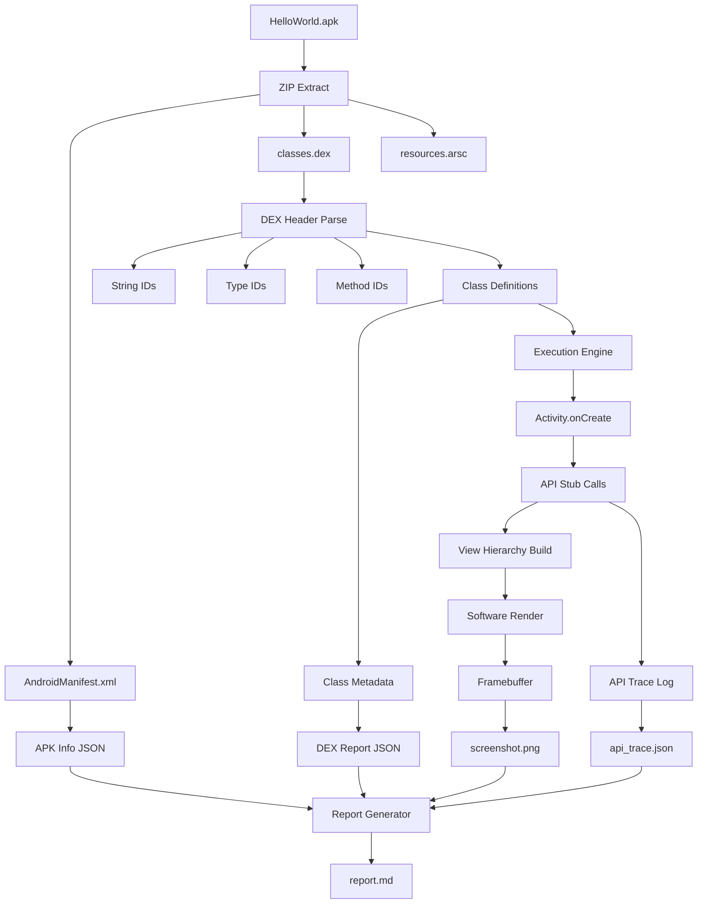

# MiniAndroid Runtime — Dependency Map

## Overview

This document maps all dependencies required for MiniAndroid v0.1 to function, from the APK file down to the final rendered output.

---

## Dependency Hierarchy

```
┌─────────────────────────────────────────────────────────────────────┐
│                        INPUT LAYER                                  │
├─────────────────────────────────────────────────────────────────────┤
│                                                                     │
│   ┌─────────────────┐         ┌─────────────────┐                  │
│   │  HelloWorld.apk  │         │  Android SDK     │                  │
│   │  (ZIP Format)    │         │  (Reference)     │                  │
│   └────────┬─────────┘         └────────┬─────────┘                  │
│            │                            │                           │
│            ▼                            │                           │
│   ┌─────────────────┐                   │                           │
│   │  ZIP Library    │◄──────────────────┘                           │
│   │  (zlib/minizip) │                                               │
│   └────────┬────────┘                                               │
│            │                                                        │
└────────────┼────────────────────────────────────────────────────────┘
             │
             ▼
┌─────────────────────────────────────────────────────────────────────┐
│                      PARSING LAYER                                   │
├─────────────────────────────────────────────────────────────────────┤
│                                                                     │
│   ┌──────────────────────────────────────────────────────────┐      │
│   │                    APK Parser                            │      │
│   │  ┌─────────────────┐  ┌─────────────────┐               │      │
│   │  │ AndroidManifest │  │  Resource Table │               │      │
│   │  │ (Binary XML)    │  │  (resources.arsc)│              │      │
│   │  └────────┬────────┘  └────────┬────────┘               │      │
│   │           │                    │                         │      │
│   │           ▼                    ▼                         │      │
│   │  ┌─────────────────┐  ┌─────────────────┐               │      │
│   │  │ AXML Decoder    │  │  ARSC Decoder   │               │      │
│   │  └─────────────────┘  └─────────────────┘               │      │
│   └───────────────────────────┬──────────────────────────────┘      │
│                               │                                     │
│                               ▼                                     │
│   ┌──────────────────────────────────────────────────────────┐      │
│   │                    DEX Parser                             │      │
│   │  ┌─────────────────┐  ┌─────────────────┐               │      │
│   │  │ String Table    │  │  Type Table     │               │      │
│   │  ├─────────────────┤  ├─────────────────┤               │      │
│   │  │ Proto Table     │  │  Field Table    │               │      │
│   │  ├─────────────────┤  ├─────────────────┤               │      │
│   │  │ Method Table    │  │  Class Defs     │               │      │
│   │  └─────────────────┘  └─────────────────┘               │      │
│   └──────────────────────────────────────────────────────────┘      │
│                                                                     │
└─────────────────────────────────────────────────────────────────────┘
                              │
                              ▼
┌─────────────────────────────────────────────────────────────────────┐
│                     RUNTIME LAYER                                    │
├─────────────────────────────────────────────────────────────────────┤
│                                                                     │
│   ┌──────────────────────────────────────────────────────────┐      │
│   │                 Execution Engine                          │      │
│   │                                                           │      │
│   │  ┌─────────────┐  ┌─────────────┐  ┌─────────────────┐   │      │
│   │  │ Class Loader│  │ Interpreter │  │ Memory Manager  │   │      │
│   │  └──────┬──────┘  └──────┬──────┘  └────────┬────────┘   │      │
│   │         │                │                 │              │      │
│   │         └────────────────┼─────────────────┘              │      │
│   │                          ▼                                │      │
│   │              ┌─────────────────────┐                      │      │
│   │              │  Bytecode Executor  │                      │      │
│   │              └─────────────────────┘                      │      │
│   └──────────────────────────────────────────────────────────┘      │
│                                                                     │
│   ┌──────────────────────────────────────────────────────────┐      │
│   │               Android API Stubs                           │      │
│   │                                                           │      │
│   │  ┌────────────┐ ┌────────────┐ ┌────────────────────┐    │      │
│   │  │ app/       │ │ view/      │ │ widget/            │    │      │
│   │  │ Activity   │ │ View       │ │ TextView           │    │      │
│   │  │ Service    │ │ ViewGroup  │ │ Button             │    │      │
│   │  └────────────┘ └────────────┘ └────────────────────┘    │      │
│   │  ┌────────────┐ ┌────────────┐ ┌────────────────────┐    │      │
│   │  │ os/        │ │ graphics/  │ │ content/           │    │      │
│   │  │ Bundle     │ │ Canvas     │ │ Context            │    │      │
│   │  │ Looper     │ │ Paint      │ │ Intent             │    │      │
│   │  └────────────┘ └────────────┘ └────────────────────┘    │      │
│   └──────────────────────────────────────────────────────────┘      │
│                                                                     │
└─────────────────────────────────────────────────────────────────────┘
                              │
                              ▼
┌─────────────────────────────────────────────────────────────────────┐
│                     OUTPUT LAYER                                    │
├─────────────────────────────────────────────────────────────────────┤
│                                                                     │
│   ┌──────────────────────────────────────────────────────────┐      │
│   │                Graphics Backend                           │      │
│   │                                                           │      │
│   │  ┌─────────────────┐         ┌─────────────────┐         │      │
│   │  │ View Hierarchy  │ ──────▶ │ Software Raster │         │      │
│   │  │ (Tree)          │         │ (Pixel Buffer)  │         │      │
│   │  └─────────────────┘         └────────┬────────┘         │      │
│   │                                       │                   │      │
│   │                                       ▼                   │      │
│   │                              ┌─────────────────┐         │      │
│   │                              │ PNG Encoder     │         │      │
│   │                              │ (stb/libpng)    │         │      │
│   │                              └────────┬────────┘         │      │
│   │                                       │                   │      │
│   │                                       ▼                   │      │
│   │                              ┌─────────────────┐         │      │
│   │                              │ screenshot.png  │         │      │
│   │                              └─────────────────┘         │      │
│   └──────────────────────────────────────────────────────────┘      │
│                                                                     │
│   ┌──────────────────────────────────────────────────────────┐      │
│   │               Diagnostics Engine                          │      │
│   │                                                           │      │
│   │  ┌──────────────┐  ┌──────────────┐  ┌────────────────┐  │      │
│   │  │ API Tracer   │  │ Logger       │  │ Report Generator│  │      │
│   │  └──────┬───────┘  └──────┬───────┘  └───────┬────────┘  │      │
│   │         │                 │                 │             │      │
│   │         ▼                 ▼                 ▼             │      │
│   │  api_trace.json     crash.log         report.md           │      │
│   └──────────────────────────────────────────────────────────┘      │
│                                                                     │
└─────────────────────────────────────────────────────────────────────┘
```

---

## External Dependencies

### Required (v0.1)

| Dependency | Version | Purpose | License |
|------------|---------|---------|---------|
| **zlib** | 1.2+ | ZIP/APK decompression | zlib |
| **libpng** | 1.6+ | Screenshot output | libpng |
| **stb_image_write** | - | Alternative PNG writer | Public Domain |
| **nlohmann/json** | 3.11+ | JSON report generation | MIT |
| **Google Test** | 1.12+ | Unit testing | Apache 2.0 |

### Optional (Future Phases)

| Dependency | Version | Phase | Purpose |
|------------|---------|-------|---------|
| **Vulkan SDK** | 1.3+ | Phase 3-4 | GPU rendering |
| **SPIRV-Cross** | - | Phase 4 | Shader compilation |
| **OpenGL ES** | 3.0+ | Phase 2 | Game rendering |
| **ALSA/PulseAudio** | - | Phase 2 | Audio output |

---

## Internal Module Dependencies

```
┌─────────────────────────────────────────────────────────────────┐
│                    MODULE DEPENDENCY GRAPH                       │
├─────────────────────────────────────────────────────────────────┤
│                                                                 │
│   diagnostics ◄──── All modules trace to diagnostics            │
│      ▲                                                          │
│      │                                                          │
│   graphics                                                      │
│      ▲                                                          │
│      │     runtime                                              │
│      │       ▲                                                  │
│      │       │                                                  │
│      │     api ◄─── runtime calls API stubs                     │
│      │       ▲                                                  │
│      │       │                                                  │
│      └───────┼──────── dex                                      │
│              │       ▲                                          │
│              │       │                                          │
│              └───────┴──────── apk                              │
│                                                                 │
│   Entry Point: main.cpp                                         │
│       │                                                         │
│       ├──► apk::parse_apk()                                     │
│       │       │                                                 │
│       │       └──► dex::parse_dex()                             │
│       │               │                                         │
│       │               └──► runtime::execute()                   │
│       │                       │                                 │
│       │                       ├──► api::* stubs                 │
│       │                       │                                 │
│       │                       └──► graphics::render()           │
│       │                               │                         │
│       │                               └──► diagnostics::report() │
│                                                                 │
└─────────────────────────────────────────────────────────────────┘
```

---

## Data Flow Dependencies

### APK → Output Pipeline



---

## Android Framework Dependencies for HelloWorld

### Minimal Set Required

For a simple HelloWorld with one Activity and one TextView:

```
android.app.Activity
├── onCreate(Bundle)
├── setContentView(int)
├── onStart()
├── onResume()
└── findViewById(int)

android.os.Bundle
├── getString(String)
└── getInt(String)

android.content.Context
├── getResources()
└── getPackageManager()

android.view.View
├── draw(Canvas)
├── measure(int, int)
├── layout(int, int, int, int)
└── invalidate()

android.view.ViewGroup
├── addView(View)
└── removeView(View)

android.widget.TextView
├── setText(CharSequence)
├── getText()
├── setTextColor(int)
└── setTextSize(float)

android.graphics.Canvas
├── drawText(String, float, float, Paint)
├── drawRect(Rect, Paint)
└── drawColor(int)

android.graphics.Paint
├── setColor(int)
├── setTextSize(float)
└── setAntiAlias(boolean)

android.R (Resources)
├── id.*
├── layout.*
└── string.*
```

### Dependency Count: ~30 methods across 10 classes

---

## Build Dependencies

### CMake Target Graph

```cmake
# Core library (no external deps except zlib)
add_library(miniandroid_core STATIC
    src/apk/apk_parser.cpp
    src/dex/dex_parser.cpp
    src/runtime/execution_engine.cpp
    src/api/android_stubs.cpp
    src/graphics/renderer.cpp
    src/diagnostics/trace_engine.cpp
)

# Main executable
add_executable(miniandroid src/main.cpp)
target_link_libraries(miniandroid PRIVATE miniandroid_core)

# Test executable
add_executable(miniandroid_test tests/main.cpp)
target_link_libraries(miniandroid_test PRIVATE miniandroid_core gtest_main)
```

---

## Platform Dependencies

### Linux (Primary Target)

```
Required System Packages:
├── build-essential (gcc, g++, make)
├── cmake (>= 3.16)
├── libz-dev (zlib)
├── libpng-dev (PNG output)
└── vulkan-sdk (optional, for GPU backend)
```

### macOS (Secondary)

```
Required via Homebrew:
├── cmake
├── zlib
├── libpng
└── molten-vk (optional Vulkan)
```

### Windows (Tertiary)

```
Required via vcpkg:
├── zlib
├── libpng
└── cmake
```

---

*Document Version: 1.0*  
*Last Updated: EXP-001 Start*
