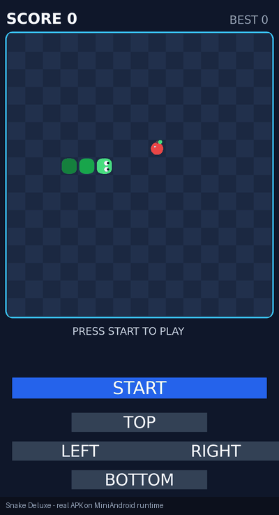
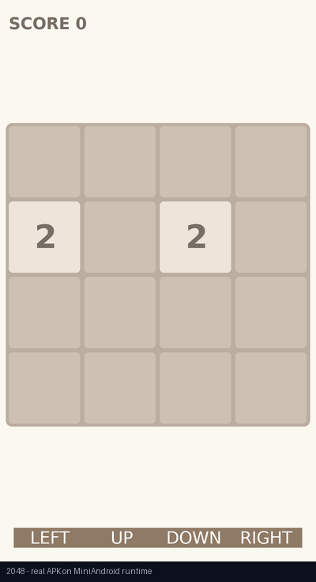
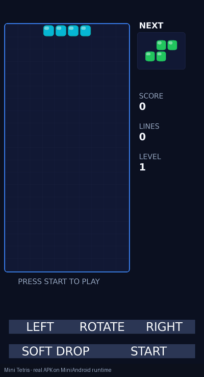

# MINIANDROID — Android Compatibility Runtime

<p align="center">
  
</p>
<p align="center"><sub>Decorative mascot (a Silkie hen) — not an Android/Google mark; carries no claim.</sub></p>

**Repository:** https://github.com/Sh-TB/MiniAndroid-Compatibility-Runtime (original project, not a fork) · **License:** MIT · **Wave:** S95-CTRL (engineering control system)

---

## MISSION

Execute **real Android APKs** on a from-scratch runtime and prove compatibility
with **measurable, hash-pinned evidence** — not screenshots that merely look
plausible: real DEX execution, real lifecycle, real view trees, real input, real
state change, real pixels.

**MINIANDROID IS** — a C++17 compatibility runtime: APK
→ Manifest / Resources → DEX → Runtime → Android object model → Lifecycle
→ View/Layout → Rendering → Input → Storage/Concurrency/Media → meaningful
application state → meaningful screenshot/output. Every claim is pinned to
committed SHA256-tracked evidence; nothing is asserted from `rc=0` alone.

**MINIANDROID IS NOT** — an Android agent, a computer-use agent, a static APK
analyzer, a game-only emulator, or a screenshot generator. There is no Linux
kernel, no ART/Dalvik binary, no GPU: app logic runs through a re-implemented
Dalvik-class interpreter over a deterministic software raster pipeline.

---

## 0→100 STATUS · CURRENT VERIFIED STATUS

> Full map: [docs/MINIANDROID_0_TO_100.md](docs/MINIANDROID_0_TO_100.md) ·
> evidence-derived; validated by `tools/validate_control_system.py`.

| Signal | Value (canonical source) |
|---|---|
| Real APK corpus executed & recorded | **148** (87 games · 60 apps · 1 fixture) — [canonical/registry.json](docs/evidence/canonical/registry.json) |
| Content-verified tier | **22 VERIFIED** (+ 5 candidate visual/interactive, 12 interactive GIF titles) — [ACHIEVEMENTS.md](docs/ACHIEVEMENTS.md) |
| Honest frontier tier | 112 OBSERVED · 7 PARTIAL-family · 1 FRAME_CAPTURED · 1 FAILED — each with recorded cause |
| Regression battery | **99/99 ALL PASS** — [testing/BATTERY_INDEX.json](docs/testing/BATTERY_INDEX.json) |
| Engine roots closed | **420-root append-only registry**; 21+ ROOT-CAUSED-FIXED families — [root_registry.json](root_registry.json) |
| Source-first library | **127 entries · 122 distinct verified repos · 48 evidenced laws · 65 deep-inspected** — [GRAPHICS_SOURCE_REGISTRY.md](docs/GRAPHICS_SOURCE_REGISTRY.md) |
| Open problem state | **33 canonical tickets** (1 P0 · 10 P1 · 16 P2 · 6 P3; 29 open / 4 CLOSED) — [TICKET_REGISTRY.json](docs/TICKET_REGISTRY.json) |
| Position on 0→100 scale | **~52/100** (chain proven E4–E6; deep semantics open in text shaping, real networking, media-at-APK, web, native, modern runtimes) |

## Real Executed Apps & Games

Four real demos — actual APKs that executed on MiniAndroid with SHA-pinned,
click-to-inspect evidence (GIF + run protocol + state-change record). Status
vocabulary is the strict audit set — nothing is claimed VERIFIED beyond its
recorded evidence ([audit](docs/VERIFIED_EXECUTED_GAMES.md)):

| Demo | Capability demonstrated | Status | Source | Evidence |
|---|---|---|---|---|
| **Snake Deluxe** — full gameplay loop: 2 lives, game over, CJK dialog, restart | game loop · input · state machine · dialog | VERIFIED (E5, x2 full runs + 4-run sweep) | [in-house source](games/snake-deluxe/) | [GIF](docs/evidence/canonical/com.miniandroid.snakedeluxe.gif) · [S79 run matrix](docs/evidence/s79/reproofs/S79_REPROOF_MATRIX.json) |
| **2048** — tile merges advance SCORE to 200 | grid UI · merge state · score | VERIFIED (E4) | [in-house source](games/2048/) | [GIF](docs/evidence/canonical/com.miniandroid.g2048.gif) · [autoplay log](docs/evidence/s80/g2048_autoplay_log.txt) |
| **Mini Tetris** — falling pieces, NEXT queue, deterministic animation | timer-driven animation · game physics | VERIFIED (E5, x3 deterministic runs) | [in-house source](games/mini-tetris/) | [GIF](docs/evidence/canonical/com.miniandroid.tetris.gif) · [determinism record](docs/evidence/s95/wave_c_determinism.json) |
| **Fish Rings** — external F-Droid APK; tap repaints the 36-icon board (4,312 px measured state change) | real external APK · resources · setImageResource · persistence (L10) | VERIFIED (E5, x3 repeats + RC=0 reproof) | [upstream source](https://github.com/VelbazhdSoftwareLLC/FishRingsForAndroid) · [F-Droid](https://f-droid.org/en/packages/eu.veldsoft.fish.rings/) | [GIF/JPG](docs/evidence/canonical/eu.veldsoft.fish.rings.jpg) · [S91 reproof](docs/evidence/s91_fish_reproof/README.md) |

| | |
|---|---|
|  |  |
|  |  |

> See the complete execution GIF/evidence index:
> **[docs/EXECUTED_GIFS.md](docs/EXECUTED_GIFS.md)** — every real-execution GIF in
> the repository, with SHA, run protocol, and state-change records. The full
> per-game audit (23 games with real execution evidence; 20 VERIFIED) lives in
> **[docs/VERIFIED_EXECUTED_GAMES.md](docs/VERIFIED_EXECUTED_GAMES.md)**.

---

## ARCHITECTURE (target vs status)

```text
APK
├── Container / ZIP ................. DONE        (every corpus run)
├── Manifest / AXML ................. DONE
├── Resources / ARSC ................ DONE  (qualifiers PARTIAL)
├── DEX
│   ├── Parser / Resolver ........... DONE
│   ├── Interpreter ................. DONE        (invoke/array/exception laws)
│   └── Exceptions / Arrays / Invokes DONE      (96-stage semantic family)
├── Java / Kotlin Object Model ...... PARTIAL    (modern idioms open: DEX-001)
├── Android Framework
│   ├── Context / Activity / Intent . TESTED
│   ├── Lifecycle ................... DONE        (incl. Fragment super-chain)
│   └── Services .................... PENDING
├── UI
│   ├── View / Measure / Draw ....... DONE        (custom-view onDraw open: GFX-001)
│   ├── Layout ...................... TESTED      (weights open: GFX-002)
│   ├── Input (click / long-press) .. TESTED
│   └── Accessibility / Semantics ... PENDING
├── Graphics
│   ├── Canvas / Paint / Bitmap ..... DONE
│   ├── Drawable / Density / Vector . TESTED      (S95: 3 titles cleared of WRONG_COLOR)
│   ├── Clip / Transform ............ TESTED      (S95: no real clip divergence found)
│   ├── NinePatch ................... UNTESTED    (GFX-004)
│   ├── Animation ................... TESTED      (S95 refuted the frozen claim)
│   └── Screenshot provenance ....... VERIFIED    (S92/S93 anti-false-positive laws)
├── Text
│   ├── Typeface / Glyph raster ..... DONE        (Latin; EXT-01 typography golden)
│   ├── Theme color chain ........... TESTED      (S95 default-dark + textColorPrimary)
│   ├── Shaping (HarfBuzz/Minikin) .. PARTIAL     (POC proven, not wired: TEXT-001)
│   └── Font fallback / RTL ......... UNTESTED    (TEXT-002)
├── Media
│   ├── Audio state machines ........ IMPLEMENTED (real codecs; APK-level UNTESTED: AUDIO-001)
│   └── Video ....................... PENDING frontier (VIDEO-001)
├── Network
│   ├── API shadow tracking ......... DONE        (instrument)
│   └── Real HTTP(S)/DNS/TCP/TLS .... GAP — TOP P0 (NET-001)
├── Storage
│   ├── Files / Preferences ......... DONE
│   └── SQLite ...................... TESTED      (Room law fixture; depth open: STORE-001)
├── Concurrency ..................... PARTIAL    (shadows; coroutines UNTESTED: CONC-001)
├── AndroidX ........................ PARTIAL    (F-NEW-171..174 chains)
├── Compose ......................... BLOCKED frontier (COMPOSE-001)
├── JNI / Native .................... PARTIAL    (bridge exists: JNI-001)
└── WebView / Browser ............... PARTIAL → SIMPLE BROWSER target (WEB-001)
```

**CAPABILITY MATRIX (per-capability status + evidence levels):**
[docs/MINIANDROID_CAPABILITY_MATRIX.md](docs/MINIANDROID_CAPABILITY_MATRIX.md)

---

## REAL APK CORPUS

148 titles with one canonical record each: source, APK SHA256, execution
session, evidence level (E0–E6), ONE canonical screenshot (interactive titles
get ONE GIF). In-house instrument games: Snake Deluxe · Mini Tetris · 2048 ·
TicTacToe Deluxe · MiniCraft. External families from F-Droid + upstream
repositories (Vector Pinball, URLChecker, Dooz, TicTacToe Classic, Dodge,
SolitaireCG, Mines 3D, …). Corpus registry:
[docs/ACHIEVEMENTS.md](docs/ACHIEVEMENTS.md) ·
[docs/evidence/canonical/registry.json](docs/evidence/canonical/registry.json) ·
downloader: `miniandroid/scripts/download_test_apks.py` (zero-APK-in-repo law;
cache outside the repo, SHA-pinned).

## OPEN PROBLEMS

**Single source of truth:** [docs/TICKET_REGISTRY.json](docs/TICKET_REGISTRY.json)
(31 tickets) — status vocabulary `UNKNOWN/UNTESTED/OBSERVED/PARTIAL/FAILED/
ROOT_CAUSE_FOUND/IMPLEMENTED/TESTED/VERIFIED/BLOCKED/PENDING/CLOSED/SUPERSEDED`.

| Top open tickets | Area | Status |
|---|---|---|
| **NET-001 real HTTP(S) stack** (P0) | network | OBSERVED gap — no real socket today |
| GFX-001 programmatic UI execution | graphics | ROOT_CAUSE_FOUND ([C013-ONDRAW] evidence) |
| GFX-002 LinearLayout weight measure | graphics/layout | ROOT_CAUSE_FOUND (~1645px children) |
| WEB-001 simple browser target (reuse matrix first) | web | PENDING |
| GFX-003 GIF disposal semantics (12 titles) | graphics | OBSERVED |
| TEXT-001 shaping wire-up (HarfBuzz POC → runtime) | text | PARTIAL |
| COMPOSE-001 / DEX-001 modern-runtime frontier | dex/compose | OBSERVED (dooz, Telegram L1) |

Recently CLOSED (do not redo): bobball, mini-tetris, minicraft, hotdeath
parent records (S95 evidence chains; the ANIMATION_FROZEN family was refuted
as a harness tap-miss with 3-run deterministic proof).

## HIGH-RISK AREAS

Predictive risk register (risks WITHOUT tickets are forbidden — every row
carries one): [docs/MINIANDROID_RISK_REGISTER.md](docs/MINIANDROID_RISK_REGISTER.md).
Top predicted families: thin-glyph verifier false positives (GFX-005),
shader/color-filter silence (GFX-006), coroutine scheduling (CONC-001),
JMM visibility (CONC-002), TLS error surfaces (NET-003/004), SQLite
transactions (STORE-001), JNI native loading (JNI-001).

## SOURCE-FIRST LIBRARY

S94's Graphics Source Library is permanent infrastructure and the prototype
for every subsystem: **classify → look up → read upstream source AND tests →
only then implement. Never reproduce behavior from memory.**

- Registry: [docs/GRAPHICS_SOURCE_REGISTRY.md](docs/GRAPHICS_SOURCE_REGISTRY.md)
  (+ `.json`, 127 entries / 122 repos / 48 laws, license map with pinned SHAs)
- Automatic consultation (mandatory): `python3 tools/source_lookup.py <category>`
- Proven on real APKs: [docs/GRAPHICS_SOURCE_LIBRARY_VALIDATION.md](docs/GRAPHICS_SOURCE_LIBRARY_VALIDATION.md)
  (8 laws implemented · 7/11 titles improved · fan-out measured · controls stable)
- Reuse-first ledger: [docs/GRAPHICS_DO_NOT_REINVENT.md](docs/GRAPHICS_DO_NOT_REINVENT.md)
- No new custom code without a recorded upstream-search answer.

## CONTRIBUTOR QUICK START

- **Guide:** [docs/MINIANDROID_TICKET_GUIDE.md](docs/MINIANDROID_TICKET_GUIDE.md)
- **Contributing:** [docs/MINIANDROID_CONTRIBUTING.md](docs/MINIANDROID_CONTRIBUTING.md)
- **20 minutes?** Reproduce a ticket · verify an APK SHA · run the battery ·
  validate a control APK.
- **2 hours?** Port a law behind a fixture (GFX-002 weight law is ready) ·
  add a battery stage · run a fan-out measurement.
- **Advanced?** NET-001 (P0 networking) · DEX/ART idioms · shaping wire-up ·
  browser reuse matrix.
- Bootstrap: `make -j` (in `miniandroid/`) →
  `bash scripts/build/bootstrap_toolchain.sh` →
  `bash scripts/test/run_test_battery.sh` (expect **99/99 ALL PASS**) →
  `python3 tools/validate_control_system.py`.

## EVIDENCE STANDARD

Levels: **E0** hypothesis · **E1** source evidence · **E2** unit test ·
**E3** runtime trace · **E4** real APK execution · **E5** deterministic
repeated APK execution · **E6** corpus fan-out.
A capability cannot be marked DONE without the appropriate evidence level;
"implemented" ≠ "verified". Screenshot claims follow the S92/S93 laws — no
FULLY_VERIFIED from nonblank images, entropy, color counts, PNG validity or
exit codes; semantic evidence only. BEFORE/AFTER claims require same APK +
same input + same capture protocol. Unmeasurable values are reported as
`NOT_MEASURED`, never invented.

## ROADMAP

- Master 0→100: [docs/MINIANDROID_0_TO_100.md](docs/MINIANDROID_0_TO_100.md)
- Wave-level reconciled status: [docs/ROADMAP_STATUS.md](docs/ROADMAP_STATUS.md)
- Priority queue: [docs/MINIANDROID_MASTER_QUEUE.md](docs/MINIANDROID_MASTER_QUEUE.md)
- Knowledge index: [docs/KNOWLEDGE_INDEX.md](docs/KNOWLEDGE_INDEX.md) ·
  doc index: [docs/INDEX.md](docs/INDEX.md)

## RECENT VERIFIED ACHIEVEMENTS

- **S95 P0 execution wave:** S94's source library PROVEN on real APKs —
  8 laws implemented from pinned upstream evidence; hotdeath FAIL→PASS;
  bouncy/urlchecker WRONG_COLOR 3×→0; bobball WRONG_CLIP 4×→0 (buttons
  44→126 px via the AOSP 48dip law); mini-tetris/minicraft frozen-claims
  refuted (3-run determinism); simplestopwatch theme layers fixed, one named
  gap left; controls 3/3 stable; battery 99/99. Canonical table:
  [docs/GRAPHICS_SOURCE_LIBRARY_VALIDATION.md](docs/GRAPHICS_SOURCE_LIBRARY_VALIDATION.md).
- **S94:** 122 distinct verified repositories, 48/48 evidenced semantic laws,
  426 hash-evidenced files, permanent registry + automatic lookup law
  (CONSTITUTION §170).
- **S92/S93:** adversarial visual-verification battery (tamper-proof),
  15-state verdict ladder, TABLE OF TRUTH corpus.
- Full ledger: [docs/ACHIEVEMENTS.md](docs/ACHIEVEMENTS.md) ·
  [docs/EXECUTION_ACHIEVEMENTS.md](docs/EXECUTION_ACHIEVEMENTS.md)

## CURRENT BLOCKERS

1. **NET-001 (P0)** — no real network stack; urlchecker's core function and
   networked apps are shadow-recorded only.
2. **COMPOSE-001/DEX-001** — modern runtime idioms block Compose-family apps
   at L1 (dooz, Telegram honestly OBSERVED).
3. **GFX-001/GFX-002** — two root-caused measure/dispatch gaps with
   fixture-ready plans (P1, execution-ready).
4. **Video frontier (VIDEO-001)** — reuse matrix required before any code.
5. **Backup branch publication** — `backup/s78-accidental-snapshot` contains a
   150.98MB zip (> GitHub's 100MB hard limit); needs an owner decision (LFS or
   history rewrite); `main` is fully published.

## HOW TO HELP

Pick by skill: graphics → GFX-00x · text → TEXT-00x · networking → NET-00x ·
parsing/runtime → DEX-00x · tests/fixtures → the UNTESTED pool (10 tickets) ·
upstream research → the 57 IDENTITY_ONLY registry repos. Then follow the
ticket guide's 9-step chain. The project optimizes for: **more compatibility,
less custom code, more reuse, more tests, more real APK execution, more
fan-out — zero guessing.**
