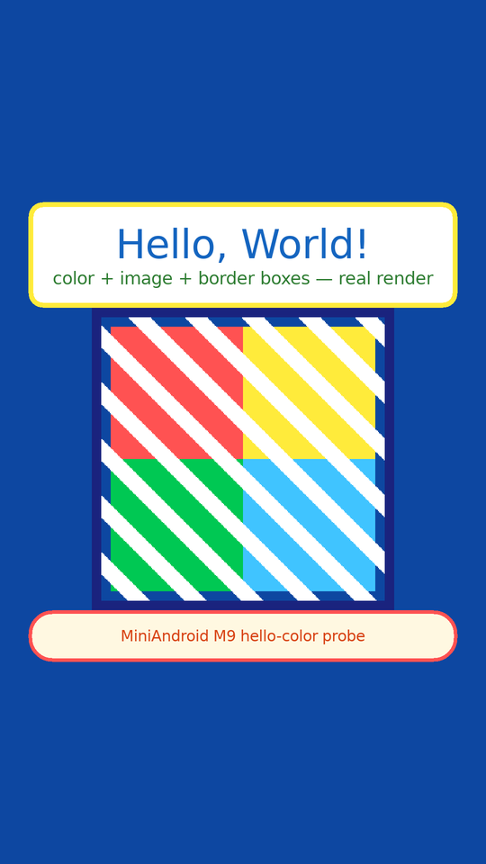

# MiniAndroid — a from-scratch Android APK Compatibility Runtime

<p align="center">
  
</p>
<p align="center"><sub>Decorative project mascot — a Silkie hen. Not an Android/Google mark; carries no claim.</sub></p>

**Current Release:** `v0.0.5 — Silkie` (Hello Color real-APK execution milestone, 2026-09-12)
**Previous:** `v0.0.4-Chantecler` (Choreographer frame-pump family F-050) · `v0.0.3 — Chantecler` (Compose frontier + root-law closure) · `v0.0.2 — Australorp` (real-APK execution proof) · `v0.0.1 — Brahma`
**Repository:** https://github.com/Sh-TB/MiniAndroid-Compatibility-Runtime (original project, not a fork)
**License:** MIT

---

## Verified Real APK Execution

<p align="center">
  
</p>

**Hello Color is now verified as a real APK execution and rendering path in MiniAndroid.**
The image above is the runtime's own framebuffer capture — not a mockup, not a reference
image, not a golden used as input.

Provenance chain (forensically verified, three-run deterministic):

```text
Source → APK (77863f1f…) → DEX → MiniAndroid Dalvik interpreter
      → Android Activity/View calls → framebuffer (PPM fb9f1df2…)
      → PNG (11e00563…) — pixel-identical across 3 independent runs
```

Full forensic record: [`docs/evidence/hello_color_golden/PROVENANCE_FORENSIC.json`](docs/evidence/hello_color_golden/PROVENANCE_FORENSIC.json)
(execution traces, opcode-level `REAL_DALVIK_INTERPRETER` evidence, framebuffer↔PNG byte
identity, golden-never-input proof). The README image is a pure Lanczos downscale of the
real frame — transform + SHA relation in [`docs/assets/DERIVED_IMAGE_PROVENANCE.json`](docs/assets/DERIVED_IMAGE_PROVENANCE.json).

---

## Current Achievements

Only what the committed evidence supports — each row is machine-checkable at this tag:

1. **REAL APK EXECUTION + REAL RUNTIME RENDERING (Hello Color)** — a real aapt2+ECJ+D8-built
   APK (`77863f1f…`) executes through the first-party DEX interpreter and renders through the
   first-party software renderer (`PROVENANCE_FORENSIC.json`). Re-verified byte-identical
   (`11e00563…`) on the R-NEW-302-fixed binary.
2. **Deterministic rendering** — three independent runs produce the byte-identical framebuffer
   (PPM `fb9f1df2…` ×3) and PNG (`11e00563…` ×3); replay determinism holds.
3. **Real DEX interpreter execution** — opcode-level trace with pc/opcode/return values and
   `execution_source=REAL_DALVIK_INTERPRETER` (`exp031_5/traces/…/opcode_trace.json`).
4. **Real Android resource loading** — `setContentView` dispatches with a real resource ID
   (`2130903040`) resolved from a real binary `resources.arsc`.
5. **Real View interaction from app bytecode** — `setBackgroundColor`, `setTextColor` ×3,
   `findViewById` ×4 (real heap objects) are invoked by the app's own DEX, not by the host.
6. **HelloWorld (golden battery)** — §28 golden battery 26 checks PASS at the F-076 binary;
   3-run byte-identical (S18 record). Re-PASS on the MC4 binary (fresh cache).
7. **TicTacToe (real interaction)** — X to move → O to move → **X WINS** across a 10-frame
   golden with per-frame SHA256 (`docs/evidence/tictactoe_golden/`); §29 interaction +
   determinism 8 checks PASS at F-076. Re-PASS on the MC4 binary.
8. **ChessClock (real corpus APK)** — rc=0 ×3 with a real deterministic framebuffer screenshot
   (1080×1920, 2,073,600/2,073,600 painted pixels, SHA `e4a2d7c9…` ×3 byte-identical;
   `docs/evidence/campaign3_chessclock_real_screenshot/`). Re-verified byte-identical on the
   MC4 binary.
9. **R-NEW-302 FIXED (MC4 self-improvement)** — the demo app's box now MOVES on its declared
   5×4 grid: three stacked layout-law gaps closed in one pass — (a) FrameLayout child margins
   + `lp_gravity` were never applied by the measure/layout pass (now the full AOSP
   `FrameLayout.layoutChildren` law), (b) a programmatic root with UNSET params wrapped to its
   content (600×1432) instead of filling the window (now MATCH_PARENT per the AOSP
   `ViewRootImpl` window law), (c) DEX-driven tree mutations never re-measured (now the AOSP
   `requestLayout` law: mutations raise a dirty flag; the next frame re-runs measure/layout).
   `demo/validate_demo_proof.sh` VALIDATION_PASS with box pixel position equal to the
   declared `pos=(x,y)` each frame; zero regressions (fresh-cache battery: §28 + §29 PASS,
   the only FAIL remains the pre-existing GATE H glyph gap); Hello Color + ChessClock frames
   byte-identical before/after. Regenerated `docs/demo/{demo_proof.gif,demo_frames.png,
   demo_manifest.json}`.
10. **REAL TELEGRAM v12.10.1 executed (MC4 frontier)** — the official 73 MB
    `org.telegram.messenger.web` 70389 APK (sha256 `f5e11927…`, fetched from
    telegram.org) parses (`analyze` rc=0: package/version/launcher extracted), LAUNCHES,
    and paints one full-screen themed frame (2,073,600/2,073,600 px). After the
    `ActivityManager.getMemoryClass()` fix (eliminated the `LruCache`
    `IllegalArgumentException("maxSize <= 0")` ×62 kill), the app advances deeper into
    `LaunchActivity` init and now hits a desugared-streams dispatch gap
    (**R-NEW-303**, honestly open). Evidence: `docs/evidence/mc4_telegram/`. NOT claimed
    usable — a frontier record, every statement bound to the committed logs.
11. **MC4 corpus sweep (13 real APKs, standard path, zero flags)** — 8 exit rc=0 with real
    rendered frames (gmdice 1.74M px, simplestopwatch 1.94M px, headingcalc 2.05M px with a
    full blue keypad grid, microtimer 1.04M px keypad, unote UI chrome, dooz/tictactoe_gdx
    blank at known GL/Compose boundaries, simplekeyboard blank — IME hosting not built yet);
    5 exit rc=1 with honestly-classified causes (kiss: AppCompat theme resolution gap;
    openlauncher: Fragment-host attach gap; bgclock: WebViewAssetLoader builder gap;
    stopwatch2: androidx init; tictactoe_gdx: GLSurfaceView boundary).
12. **Current open frontier (hidden nowhere)** — **F-077** (Compose initial composition hits a
    kotlinx TrieNode invariant NPE — the one remaining break before the first Compose frame
    request), **R-NEW-303** (Telegram desugared-stream builder dispatch), plus the corpus
    gaps above. MiniAndroid is an actively developed compatibility runtime;
    compatibility/runtime semantics are still being closed, and every gap above is tracked in
    `root_registry.json` (303 roots).

---

# Latest Verified Progress

| Field | Value |
|---|---|
| **HEAD** | MC4 working tree (v0.0.5-Silkie lineage + R-NEW-302 layout-law fix + ActivityManager.getMemoryClass law) |
| **DATE** | 2026-09-12 |
| **BATTERY** | **fresh-cache run on the MC4 binary: §28 helloworld PASS, §29 tictactoe PASS, fixture pixel goldens PASS — the only FAIL is the REAL, pre-existing GATE H simplestopwatch glyph-to-framebuffer gap (queued). Zero regressions from the R-NEW-302 fix. |
| **REAL APK** | Hello Color `77863f1f…` (forensic provenance, 3-run deterministic) · ChessClock `5ca6f2c5…` (deterministic frame ×3) · 13-app open-source corpus + lighthouse dooz `d81292cd…` (SHA-pinned) |
| **PROVEN ROOTS** | F-028, F-028h, F-029, F-030, F-031..F-033, F-035, F-036, F-039..F-045, **F-050a..e (Choreographer frame pump family)**, F-053 (GradientDrawable shapes), F-054..F-057 (hashCode/Long-bits/Arrays.fill/view-node duality), **F-070..F-073 (S20: identity-equals, invoke-range static flag, CAS, Object sentinel)**, **F-074/F-075 (S21: superclass dispatch walk, polymorphic zero law)**, **F-076 (S22: active-cycle static identity — nested coroutine starts)** — evidence links in `docs/ROOT_IMPACT_MATRIX.md` + `docs/root-searchlight/` |
| **CURRENT FRONTIER** | **F-077** — Compose initial composition NPE (kotlinx TrieNode invariant, `K/t.s` check-cast): the one remaining broken transition before the first Compose frame request; heap-probe evidence live. Plus **R-NEW-303** (Telegram desugared-streams accept dispatch — real Telegram v12.10.1 advanced past the LruCache kill to this blocker). **R-NEW-302 is FIXED** (layout laws + requestLayout). Registry: 303 roots, honest status per root |
| **TicTacToe (fixture golden)** | Real interaction X→O→X WINS, 10-frame golden, 3-run deterministic (§29 PASS). Corpus libGDX `tictactoe.apk` remains a GLSurfaceView boundary (historical T3/BLANK record, unchanged) |
| **Telegram** | **REAL APK EXECUTED (frontier)** — official v12.10.1 `org.telegram.messenger.web` 70389 (73 MB, sha256 `f5e11927…`, fetched from telegram.org on 2026-09-11): parse OK, launch OK, one full-screen themed frame painted (2,073,600/2,073,600 px); `ActivityManager.getMemoryClass()` fix eliminated the LruCache `maxSize <= 0` kill (×62); deeper init now blocked by the desugared-streams dispatch gap (R-NEW-303, honestly open). Evidence: `docs/evidence/mc4_telegram/`. NOT claimed usable |
| **WhatsApp** | NO DIRECT APK EXISTS — whatsapp.com/android 301-redirects to the store pages; there is no official sideloadable artifact to test. Recorded honestly; no fake download attempted |
| **IMPACT (S22)** | F-076 un-stubs legitimate nested coroutine starts (engine active-cycle guard keyed statics by (class,method) only): Recomposer runner while-loop now STARTS, initial composition advances deep into slot-table writes — before F-077's TrieNode break |
| **KNOWN LIMITATIONS** | dooz/Compose framebuffer still 0 non-white (F-077, deterministic `31ddd4d5…`); GATE H glyph gap; headingcalc display-row text overlap (open visual gap); kiss AppCompat theme-resolution gap; openlauncher Fragment-host attach gap; bgclock WebViewAssetLoader gap; WeakReference + DecorView content-hierarchy roots open |

**DOOZ HAS ADVANCED THROUGH THE RECOMPOSER / FRAME-CLOCK MACHINERY
(Choreographer family landed, four scheduler-corruption roots closed),
BUT THE FINAL COMPOSE FRAME IS STILL NOT PROVEN/RENDERED.**

Do NOT claim Compose success from this README — the framebuffer is blank
and the statement above is the current verified truth.

---

## What is MiniAndroid?

A from-scratch C++17 runtime that:

1. parses real APK files (ZIP + `resources.arsc` + binary XML + DEX),
2. interprets real Dalvik bytecode with tagged-value semantics,
3. resolves real resources and inflates real view trees,
4. dispatches the real Android lifecycle and input pipeline,
5. renders to a software framebuffer with pixel-evidence output
   (screenshots + per-frame SHA256 + deterministic replay).

### What it is NOT

- **Not** an emulator or a JVM/ART fork — the DEX interpreter, resource
  stack, and framework shadows are all first-party C++.
- **Not** a GUI product — it is a compatibility runtime and evidence engine.
- **Not** claimed complete: every capability row below names its evidence,
  and every known gap is listed, not hidden.

## Architecture / execution pipeline

```text
APK ZIP
 → Manifest (AXML) → PackageManager/activity registration
 → resources.arsc (string pools, packages, configs) + res/ drawables
 → classes(.N).dex → class_data delta chains → method/field resolution
 → Dalvik interpreter (tagged registers, per-opcode laws)
 → framework shadows (Context/Activity/View/Handler/… service registry)
 → lifecycle (onCreate → onStart → onResume) → view tree
 → measure/layout → software Canvas render → framebuffer PNG + SHA256
 → input: click/tap dispatch through the app's own DEX handlers
 → deterministic virtual-time Looper (3-run byte-identical law)
```

## What is now proven (evidence-backed at this commit)

### Headline: real-APK execution proof with visible state transitions

A dedicated, fully open-source demo app (`demo/`, MIT) is built with the
official Android toolchain components (ECJ + AOSP D8 + Google's API-34
`android.jar`) and executed end-to-end: a click dispatches through DEX
bytecode and changes EVERY visible state dimension at once — counter,
position, color, status text — with per-frame SHA256 evidence and a
deterministic replay check (8 clicks, 9 frames, all hashes distinct,
3-run replay byte-identical).
Evidence: [docs/demo/EVIDENCE.md](docs/demo/EVIDENCE.md),
[docs/demo/demo_proof.gif](docs/demo/demo_proof.gif).

### The golden fixture: interactive Tic-Tac-Toe

`9/9 clicks dispatched · turn alternation · X WINS · glyph ink localized
per cell · frames 7/8/9 byte-identical (frozen game) · 10-frame replay
byte-identical across independent runs` — battery stage §29.

### Real-APK corpus (SHA-verified)

| APK | Status |
|---|---|
| HelloWorld (self-aware) | renders, 99% non-white, EXT goldens |
| tictactoe_golden (fixture APK) | 9/9 clicks, X WINS, deterministic |
| microtimer | renders (50% non-white), F-012 persistence PASS |
| simplestopwatch | renders (110k px), interaction-driven state |
| gmdice | renders (84% non-white), menu/roll state flips |
| chessclock | per-panel timers via postDelayed + virtual clock, 3-run byte-identical |
| unote | XML onClick handlers fire on the hosting Activity |
| **dooz (Compose lighthouse)** | **execution frontier advanced — see below** |

### Compose status (F-044 era — nothing overstated)

- Compose attach executes: `setContent → ComposeView → AndroidComposeView
  → onAttachedToWindow` runs to its LAST DEX instruction; the derived-state
  machinery (Snapshot/MutableState/DerivedSnapshotState version hashes,
  dependency tables) executes as real DEX.
- The runtime now correctly executes the Compose **derived-state
  dependency-change law** (F-044): version hashes keep their full 32-bit
  values, so a state write invalidates a derived read — pre-F-044 every
  such hash collapsed to a boolean and derived state was permanently stale.
- `System.identityHashCode` follows the OpenJDK identity law (F-045) —
  previously a silent fail-soft 0-for-everything.
- **NOT yet proven: a visible Compose frame.** The remaining blocker is the
  first-frame pump (Recomposer frame → measure/layout/draw through the
  AndroidUiDispatcher/MonotonicFrameClock delayed dispatch) — root-located,
  documented, PENDING. dooz's framebuffer is still blank and we say so.

### Root-law ledger

Every fix is a **semantic law** (no app special-casing, ever), upstream-
evidenced against AOSP/ART/OpenJDK/AndroidX, micro-proven with a real
ECJ+D8 DEX fixture, and regression-gated by the battery:
[docs/ROOT_LAW_GLOBAL_AUDIT.md](docs/ROOT_LAW_GLOBAL_AUDIT.md) (full ledger
with per-root impact columns),
[docs/ROOT_LAW_COMPLETENESS_MATRIX.md](docs/ROOT_LAW_COMPLETENESS_MATRIX.md)
(family closure status — root complete ≠ family closed),
[docs/ROOT_LAW_IMPACT_REPORT.md](docs/ROOT_LAW_IMPACT_REPORT.md) (what
actually improved, with before/after),
[docs/ROOT_DISCOVERY_GUIDE.md](docs/ROOT_DISCOVERY_GUIDE.md) +
[docs/ROOT_DISCOVERY_EVIDENCE.md](docs/ROOT_DISCOVERY_EVIDENCE.md) (how a
failure becomes a root candidate — the F-044 worked example).

## Determinism — how to reproduce

```bash
make clean && make -j
bash scripts/run_test_battery.sh        # → "BATTERY GATE: ALL PASS (88 stages)"
./miniandroid/build/miniandroid run <apk> -o run/out
# every run: screenshot.png + screenshot.ppm + report.md + crash.log
# 3-run law: byte-identical framebuffer SHA256 across independent runs
```

## Quick start (release artifact)

```bash
tar xzf MiniAndroid-v0.0.3-*-linux-x64.tar.gz && cd miniandroid-0.0.3
./miniandroid run demo.apk -o run/demo
# → proof/frames/*.png + proof/frames/manifest.json (per-frame SHA256)
```

## Release provenance (v0.0.3 policy)

`source commit == tag commit == binary build commit`. The exact source
commit, tag, binary, artifact SHA256s and release notes form one traceable
chain — see [docs/RELEASE_v0.0.3.md](docs/RELEASE_v0.0.3.md) and the
`SHA256SUMS_v0.0.3.txt` asset. (Earlier releases' tag/build skew is
documented in their notes; v0.0.3 closes that gap.)

## Known Limitations (real, current — nothing hidden)

1. **Compose final UI**: no visible Compose frame yet — the first-frame
   pump (delayed dispatch through the frame clock) is the documented next
   battle. dooz renders a deterministic BLANK frame and we claim nothing
   more.
2. **GLES dispatch hook** (K-25): PortableGL glue exists (standalone golden
   cube renders) but the GLSurfaceView/EGL loop is not wired into the
   engine.
3. **Layout geometry**: weight distribution wrong (simplestopwatch buttons
   render full-height).
4. **Fonts**: BitmapFont long-string overlap (SFS-010); the
   FreeType+HarfBuzz+FriBidi RTL pipeline is a proven POC (6/6 Persian
   samples), not yet the TextView path.
5. **Telegram golden APK** (K-26): exact build lost from external cache;
   upstream serves newer bytes → baseline not re-assertable until
   re-acquired. simplestopwatch carries the pixel-exact regression proof.
6. **Canvas matrix composition**: dispatch presence verified; exhaustive
   rotate+scale+clip interplay tests still missing.
7. **Obfuscated AXML** (`res/0s.xml`-style trees): abort safely (guarded),
   not inflated.
8. **JNI/ELF**: boundary classification only; no loader (no corpus APK
   currently demands it; missing native libs are never reported as Java
   blockers).

## Methodology — how this project defines PROVEN

`APK execution → actual view/layout/draw operations → real software
framebuffer → screenshot artifact → SHA256 + non-white count + 3-run
reproducibility`. A synthetic screenshot, an rc=0, or a method count is
NOT evidence. `PROVEN / IMPROVED / REMAINING BOUNDARY` are reported as
three separate levels in every release.

## Roadmap

1. Compose first-frame pump (the scheduler/delayed-dispatch law) → the
   first non-blank Compose frame, pixel-proven.
2. Compose interaction (tap → recompose → re-render).
3. System-service family completion (F-046 candidates).
4. Measure/weight edge semantics quantified against a weights-heavy APK.
5. Independent Compose APK (a second Compose app, not dooz).

Historical context and the full fix ledger:
[MASTER_PROJECT_KNOWLEDGE.md](MASTER_PROJECT_KNOWLEDGE.md),
[NOT_DONE.md](NOT_DONE.md), [START_HERE.md](START_HERE.md).

---

**Repository:** https://github.com/Sh-TB/MiniAndroid-Compatibility-Runtime
· **License:** MIT · Every claim on this page is re-verified at each push
by the 88-stage battery.
