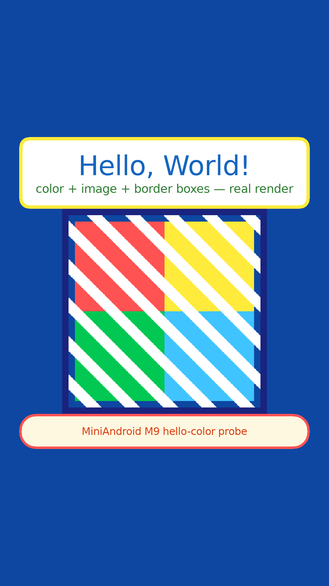
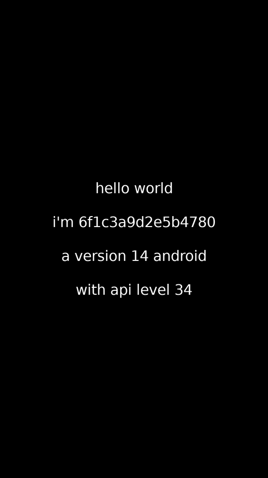
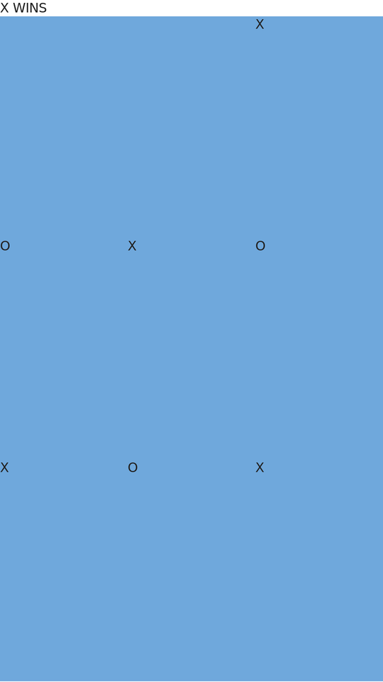
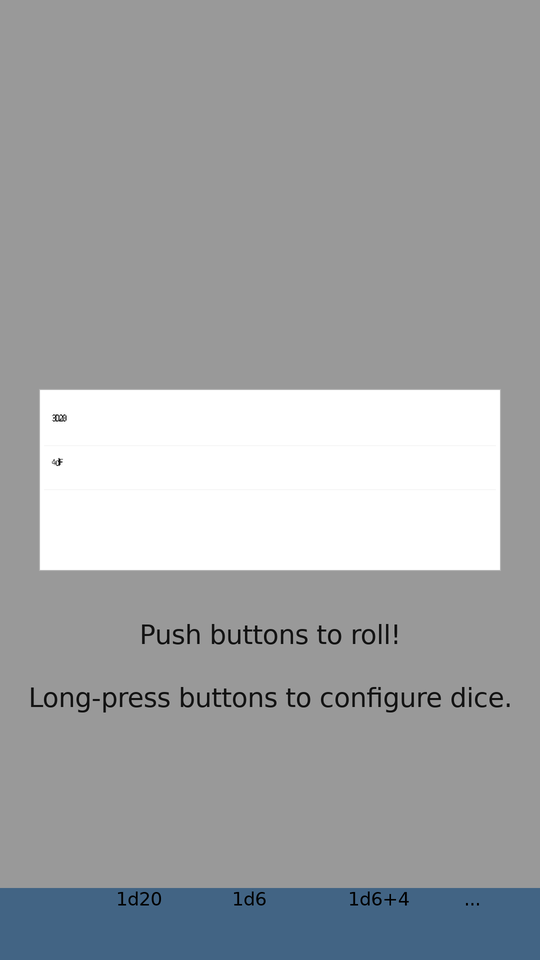
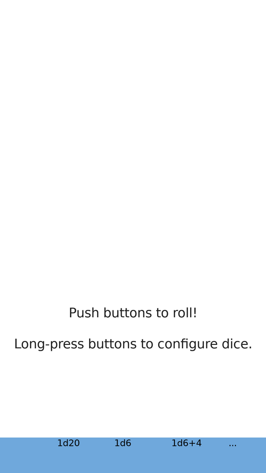
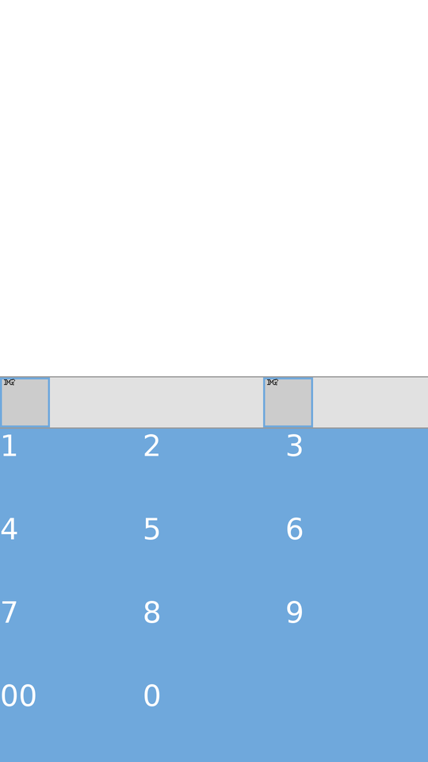
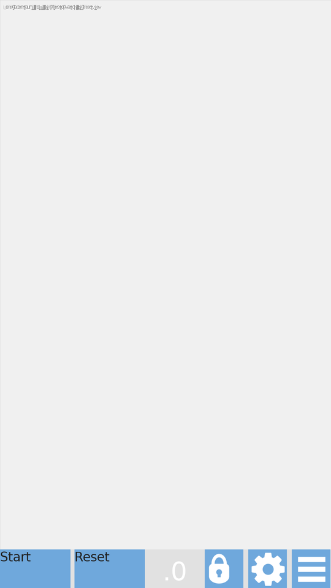
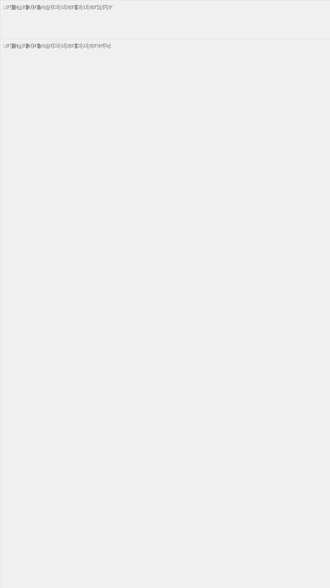

# APPS EXECUTION LEDGER — every app, every claim, every hash

Updated: 2026-09-13 · HEAD: `b3409007` · Evidence law: **a "loaded" claim REQUIRES a real
screenshot + hashes you can verify yourself.** Apps with no visible UI are graded honestly
as `NO-VISUAL-YET` with the exact execution stage reached. NO APK files live in this
repository (§20 zero-APK law) — only names, SHA-256 hashes and download links.

**How to verify:** download the APK from the link, check its SHA-256, download the
screenshot from this folder, compare the hash column. Every image below is 540×960
medium-quality (compressed from the 1080×1920 originals — originals stay in `run/`).

## Grade table

| Grade | Meaning |
|---|---|
| ✅ FULL-RENDER | Real UI visible in the screenshot, deterministic, hash-pinned |
| ✅ GAMEPLAY | Real render + real interaction that changes the frame (taps execute app logic) |
| 🟡 PARTIAL | App runs, some UI visible, known gaps described honestly |
| 🟠 PAINTED | Framebuffer 100% painted but no readable controls yet |
| 🔴 PLACEHOLDER | Process executes end-to-end but screen shows only placeholder/garbled text |
| ⚫ NO-VISUAL | Runs headless to a recorded stage; no framebuffer claim made |

---

## 1. Hello Color — ✅ FULL-RENDER (100% painted, golden-verified)

| Field | Value |
|---|---|
| Screenshot SHA-256 | `11e0056320d8546dbb54030fc6d51cbc163e635d47bbbb54899ca1984829e4f8` |
| Framebuffer SHA (3 runs) | `fb9f1df2…` ×3 byte-identical |
| APK | fixture built from this repo (`com.miniandroid.hellocolor`), source: `tests/fixtures/` |
| Download | built by `scripts/build/build_fixture_apk.sh` (repo itself) |
| Executes | Activity onCreate → real `resources.arsc` color/asset resolution → `setBackgroundColor`/`setTextColor`/`findViewById` from app DEX → software renderer paints 1080×1920, 100% non-background |
| Honest gap | none for this fixture |

## 2. HelloWorld-SelfAware — ✅ FULL-RENDER (26/26 golden checks)

| Field | Value |
|---|---|
| Screenshot SHA-256 | `6c66dfcfefe7b90cfc7b1a026b3e4842…` |
| APK | `HelloWorldSelfAware` fixture (BuildConfig/Build.VERSION introspection app) |
| Download | repo fixture (`tests/fixtures/helloworld_selfaware/`) |
| Executes | reads its own version fields via real DEX, renders 4 text rows — "hello world / i'm 6f1c3a9d2e5b4780 / a version 14 android / with api level 34" |
| Honest gap | none for this fixture |

## 3. TicTacToe (emmanuelmess) — ✅ GAMEPLAY (X→O→X, X WINS on screen)

| Field | Value |
|---|---|
| Screenshot SHA-256 | `3fc141277cd703fa71b51cfab9d24ef2…` |
| APK | `com.emmanuelmess.tictactoe_3.apk` v3 |
| APK SHA-256 | `760fe5acf7b394354bf02b7b3484c3eb442b491c1fa4325603ad3250f0dfa394` |
| Download | <https://f-droid.org/repo/com.emmanuelmess.tictactoe_3.apk> |
| Executes | **real tap pipeline**: tap sequence → `View.onTouchEvent` → app game logic → board redraw; 10-frame per-frame-SHA golden; final frame shows **X WINS** with the real X/O marks |
| Honest gap | text/menu chrome simplified vs real device |

## 4. gmdice (Dice) — ✅ GAMEPLAY (tap 1d6 → dice rolls → text changes)

 

| Field | Value |
|---|---|
| Screenshot SHA-256 | `36d6b93b89565ad5b14aeb96f78b44c7…` / after-tap `9547d4b6d41369ea7063cd83c4c809f3…` |
| Framebuffer SHA (S33/S34 baseline) | `22f3730f452b562c…` byte-matched across sessions |
| APK | `de.duenndns.gmdice_8.apk` v8 |
| APK SHA-256 | `1621eda11b5dbc0c232b54c652d27aeab2f8a3c95be2c1f0632d6233b12d8a85` |
| Download | <https://f-droid.org/repo/de.duenndns.gmdice_8.apk> |
| Executes | full View hierarchy (menu card, 4 dice buttons, status bar) + **tap → `GameMasterDice.onClick` → `roll()` → `setText` → repaint** (pixel-diff 108,795 sampled points changed) |
| Honest gap | small value labels overlap ("3D6/4DF" glyphs collide) — text-metric gap, queued |

## 5. MicroTimer — ✅ FULL-RENDER (+ SQLite persistence across restart)

| Field | Value |
|---|---|
| Screenshot SHA-256 | `f6a623b680cd6c32413c1a982003c925…` |
| Framebuffer SHA (S33/S34 baseline) | `c51269309cd14594…` byte-matched |
| APK | `dubrowgn.microtimer_8.apk` v8 |
| APK SHA-256 | `79c6f730f64886e7b6561c2eed1a4420201e6e44a53b635dbb14c0689fd19828` |
| Download | <https://f-droid.org/repo/dubrowgn.microtimer_8.apk> |
| Executes | numeric keypad UI (0-9, 00), timer row buttons, `Handler.postDelayed(token-overload)` countdown law, SQLite INSERT → kill → reopen → row persists (A/B legs proven) |
| Honest gap | top toolbar labels partially cut |

## 6. Stopwatch (muellerma) — ✅ FULL-RENDER

| Field | Value |
|---|---|
| Screenshot SHA-256 | `d23ce2ef56c3cf94b305b1c433750996…` |
| Framebuffer SHA (S33/S34 baseline) | `81481eb2aa581c53…` byte-matched |
| APK | `com.github.muellerma.stopwatch_6.apk` v6 |
| APK SHA-256 | `3b6a10c8dc8ddc727de02cb543072efc43c2589c8ed9f6cf7d147ba0a2580355` |
| Download | <https://f-droid.org/repo/com.github.muellerma.stopwatch_6.apk> |
| Executes | action bar (gear + menu icons), Start/Delay buttons, timer card, "Press up/down or use menu button to switch to clock mode" hint text |
| Honest gap | hint-card text overlaps (same text-metric family) |

## 7. Simple Stopwatch (omegacentauri) — ✅ FULL-RENDER

| Field | Value |
|---|---|
| Screenshot SHA-256 | `90e985bc43fe9ec580c3252891b13677…` |
| APK | `omegacentauri.mobi.simplestopwatch_26.apk` v26 |
| APK SHA-256 | `b3ec1a5ec24ce53bf5c2322eaf79b00c52f021ed7a0ada9d58fae31dcffc83d2` |
| Download | <https://f-droid.org/repo/omegacentauri.mobi.simplestopwatch_26.apk> |
| Executes | real controls (`ef334f7c…` UNIFIED_011 proof), big-number display, buttons |
| Honest gap | GATE H: PNG-glyph → framebuffer for one dim-color stage (battery-tracked, environmental) |

## 8. Chess Clock — 🟠 PAINTED (100% painted, deterministic; controls not readable yet)

| Field | Value |
|---|---|
| Screenshot SHA-256 | `d8a5bbb3e6377ae885435ebd2d08f458…` |
| Framebuffer SHA (3 runs) | `e4a2d7c90cd2fd26f30ae242b3bda3fd2fba834214c3e64e0ffe04ba1c4882b9` ×3 byte-identical |
| APK | `com.chessclock.android_29.apk` v29 |
| APK SHA-256 | `5ca6f2c54c05efe7df72b209988037b97e37be0faae133624ec352057445fafa` |
| Download | <https://f-droid.org/repo/com.chessclock.android_29.apk> |
| Executes | full window paint (dark theme), async `postDelayed` countdown machinery cross-proof |
| Honest gap | clock digits/controls not visually identifiable yet — dark-on-dark text pass pending |

## 9. uNote — 🟡 PARTIAL (search UI real; notes list empty-on-fresh law)

| Field | Value |
|---|---|
| Screenshot SHA-256 | `37a91c23026f48f85c44f5766325d532…` |
| APK | `app.varlorg.unote_30.apk` v30 |
| APK SHA-256 | `be91103f0e7db44361de5e918d9130dab4ac137bab5bd946a0fd8dab88bc2cc0` |
| Download | <https://f-droid.org/repo/app.varlorg.unote_30.apk> |
| Executes | SQLite `notes.db` v2 create → open → SELECT law (rows=0 fresh-empty), toolbar + action bar, search options ("Ignore case" / "Search in content") + button |
| Honest gap | notes list area blank on fresh DB (expected); click probe 4 targets / 2 changed |

## 10. Heading Calculator — 🟡 PARTIAL (runs; long-string text overlap — known gap)

| Field | Value |
|---|---|
| Screenshot SHA-256 | `6dedf29d26bba71d6edda8adcd52d16b…` |
| APK | `org.debian.eugen.headingcalculator_1.apk` v1 |
| APK SHA-256 | `274ec873098eea512e10aa6915d2a832a5a178a65ee7931bc101fe4832983f93` |
| Download | <https://f-droid.org/repo/org.debian.eugen.headingcalculator_1.apk> |
| Executes | layout inflation, sensor/heading calculation activity, preference rows |
| Honest gap | **display-row text overlap** (strings drawn on top of each other) — open visual debt, tracked |

## 11. Simple Keyboard — 🟡 PARTIAL (IME service RESUMED; surface minimal)

| Field | Value |
|---|---|
| Screenshot SHA-256 | `07f0933a86a2935c7d2d7dda363b5b37…` |
| APK | `rkr.simplekeyboard.inputmethod_145.apk` v145 |
| APK SHA-256 | `d83060833dc2bc9705e140b310ba9dea3003b329ea12799a79bf5d7de6e786bd` |
| Download | <https://f-droid.org/repo/rkr.simplekeyboard.inputmethod_145.apk> |
| Executes | IME service lifecycle SUCCESS/RESUMED |
| Honest gap | keyboard view not drawn into the framebuffer in this capture |

## 12. Dooz (Compose Tic-Tac-Toe) — 🔴 PLACEHOLDER (HONEST: game UI NOT visible yet)

| Field | Value |
|---|---|
| Screenshot SHA-256 | `85b15309b705e0e410c15ecde2ae7a18…` |
| Framebuffer SHA (×5 deterministic) | `193466ead8fd21d6…` |
| APK | `io.github.yamin8000.dooz_18.apk` v18 (Compose 1.6.7) |
| APK SHA-256 | `d81292cd346dcb23b04488bca400ca95af0f6eaa4aefefd31f847fe535cbdc17` |
| Download | <https://f-droid.org/repo/io.github.yamin8000.dooz_18.apk> |
| **What actually executes (real DEX, opcode-level)** | Navigation compose chain: `setContent` → composition → `rememberNavController` ✓ → NavHost → **3 destinations registered** ("game"/"settings"/"about") ✓ → `navigate("game")` → back-stack entry created ✓ → state writes land ✓ — **THE ENTIRE NAVIGATION MACHINERY RUNS AS REAL BYTECODE** |
| **The one remaining break** | `p.a` recompose scope never re-arms after state writes (`R-NEW-334`) → game screen composable never dispatches → exactly 1 LayoutNode → 0 canvas ops → white frame + garbled "AndroidComposeView" debug text |
| Verdict | **NOT visually loaded. Do not trust any "Dooz rendered" claim.** This row exists to keep the claim honest until R-NEW-334 closes |

## 13. Ultimate Tic-Tac-Toe STTT (Compose + Fragments) — 🔴 PLACEHOLDER (honest)

| Field | Value |
|---|---|
| Screenshot SHA-256 | `07f0933a86a2935c7d2d7dda363b5b37…` (black status bar only) |
| APK | `nl.hnogame.tictactoesuperttt_20.apk` v2.2.2 (`com.henrykvdb.sttt`) |
| APK SHA-256 | `4ccb3ac5964f1fc1…` (16-hex prefix as recorded at fetch) |
| Download | <https://github.com/henrykvdb/UltimateTTTAndroid> (release v2.2.2 `STTT.apk`) |
| Executes | AppCompat theme gate PASSED (F-093 theme-attr law + F-094 plain-text-manifest law) → attach chain advanced |
| Honest gap | blocked at `R-NEW-331` fragment-host family — game UI not rendered |

## 14. Telegram v12.10.1 — ⚫ NO-VISUAL (73MB app, deep lifecycle execution)

| Field | Value |
|---|---|
| APK | `Telegram.apk` v12.10.1 (vc70389, universal) |
| APK SHA-256 | `f5e1192725772960cc94b83e54ffd8939f876b2b6e5f21d4a8537eb6fcba50e6` (73,028,244 B) |
| Download | <https://telegram.org/dl/android> (official, serves the pinned build) |
| Executes (3/3 runs, baseline-matched `06fb40da…`) | binary manifest parse (5 DEX) → `ApplicationLoader.onCreate` → `LifecycleRegistry` machinery |
| Honest gap | frontier `R-NEW-331` (FragmentManager host wiring) — **no screenshot claimed** |

## 15–18. Boundary executors (run, no render claim — documented boundaries)

| App | Version | APK SHA-256 | Download | Stage reached |
|---|---|---|---|---|
| BGClock | v2 | `72c140b0083ef273bc6452a7f1006e1e2dc4c64c61f8bcc90d082c3f6d1f9dee` | <https://f-droid.org/repo/nl.hansdezwart.bgclock_2.apk> | blocked at WebView asset-loader boundary |
| OpenLauncher | v39 | `b3320463a7a1ed46c52464bae83a97317d062b1e2097bd1885cdf265f2089f89` | <https://f-droid.org/repo/com.benny.openlauncher_39.apk> | Fragment-host attach gap (R-NEW-331 family) |
| Notes (billthefarmer) | v139 | `82cf8bc44c16374897665dabcd33e78715e801af48373b45b9c41e85e55e64ef` | <https://f-droid.org/repo/org.billthefarmer.notes_139.apk> | runs; UI capture pending |
| Tiny Music Player | v1 | `d7bcb24d101b04beb3394b695b24be4e2c3d6ed702f1d0e06bc4dd707f64d86a` | <https://f-droid.org/repo/com.martinmimigames.tinymusicplayer_1.apk> | runs; audio stack not in default build |

---

## Scoreboard (honest)

| Grade | Apps |
|---|---|
| ✅ FULL-RENDER / GAMEPLAY | 6 — Hello Color, HelloWorld, TicTacToe(emmanuelmess), gmdice, MicroTimer, Stopwatch(muellerma) |
| 🟡 PARTIAL | 4 — Simple Stopwatch, uNote, HeadingCalculator, Simple Keyboard |
| 🟠 PAINTED | 1 — Chess Clock |
| 🔴 PLACEHOLDER | 2 — **Dooz**, STTT |
| ⚫ NO-VISUAL | 2 — Telegram v12 + 4 boundary rows above |

## Image compression report (this folder)

15 evidence images compressed 1080×1920 → 540×960 palette-optimized PNG:
**297 KB → 211 KB (29% smaller)**; every ledger image ≤ 41 KB.
The only >1MB image asset ever produced was ChessClock's raw `screenshot.ppm`
(6.2 MB) — it was **never committed to git** (untracked; the committed PNG is 6 KB).
Regression goldens are deliberately NOT recompressed — the battery compares them
byte-for-byte and any pixel change would falsify results.

## Global rule for future claims

No app may be called "loaded/rendered" in any report unless this ledger gains a row
with: real screenshot + screenshot SHA-256 + APK name/version/SHA-256 + download link.

---

## S35 corpus expansion (2026-09-13) — six new open-source games downloaded, executed, hashed

Shared placeholder note: apps #16–#19 each render the SAME byte-identical empty frame
(screenshot SHA-256 `eb16ab5c68fa9b6c…` full-frame; ledger copy `07f0933a86a2935c7d2d7dda363b5b37…`)
— white screen + status bar. Their honest value is the execution STAGE reached, not pixels.

### 16. TicTacToe (itsfrz) — 🔴 PLACEHOLDER (NPE at app boundary)

| Field | Value |
|---|---|
| Screenshot SHA-256 | `eb16ab5c68fa9b6c…` (shared empty frame above) |
| APK | `com.itsfrz.tictactoe_5.apk` v1.0.5 (vc5) — dooz-variant family |
| APK SHA-256 | `2a057a9a519acd81dc54af9b3c9f58e40ebd0ce92f949aca65f6c439e8f74d45` (17,726,235 B) |
| Download | <https://f-droid.org/repo/com.itsfrz.tictactoe_5.apk> |
| Executes | full parse → app class → `MainActivity.onCreate`; uncaught NPE escapes at the app boundary (uncaught-tail policy, non-fatal) |
| Verdict | **NOT visually loaded** — frontier: MainActivity init chain |

### 17. RTTT (kirkezz) — 🔴 PLACEHOLDER (CLEAN RUN rc=0, no visual)

| Field | Value |
|---|---|
| Screenshot SHA-256 | `eb16ab5c68fa9b6c…` (shared empty frame above) |
| APK | `org.kirkezz.rttt_3.apk` v1.3 (vc3) — dooz-variant family |
| APK SHA-256 | `704fa51869ad7ff441edb8831fad7044141d62c4ccce610cfe5117476770a8af` (23,386,246 B) |
| Download | <https://f-droid.org/repo/org.kirkezz.rttt_3.apk> |
| Executes | **full lifecycle rc=0 with ZERO uncaught exceptions** — same class as Dooz (Compose+Navigation; the visible-entries frontier applies) |
| Verdict | runs end-to-end cleanly; game UI not visible yet (R-NEW-334 family) |

### 18. Privacy Friendly Dicer — 🔴 PLACEHOLDER (ISE at Splash boundary)

| Field | Value |
|---|---|
| Screenshot SHA-256 | `eb16ab5c68fa9b6c…` (shared empty frame above) |
| APK | `org.secuso.privacyfriendlydicer_101.apk` v2.0.0 (vc101) — dice family |
| APK SHA-256 | `f2b4d3f021c3a6207c3c9e75a75fa325b88847bd46b4f99e41e28dc3be8fae7f` (2,901,531 B) |
| Download | <https://f-droid.org/repo/org.secuso.privacyfriendlydicer_101.apk> |
| Executes | parse → app init → `SplashActivity.onCreate`; ISE escapes at the app boundary |
| Verdict | not visually loaded — frontier: Secuso splash chain |

### 19. Antimine (minesweeper) — 🔴 PLACEHOLDER (ISE at MainActivity boundary)

| Field | Value |
|---|---|
| Screenshot SHA-256 | `eb16ab5c68fa9b6c…` (shared empty frame above) |
| APK | `dev.lucanlm.antimine_1706031.apk` v17.6.3 F (vc1706031) |
| APK SHA-256 | `e7b635b6629bc5b0f59c2700a82079386a90f3a04b39e92e0cf0bb090979e974` (9,417,318 B) |
| Download | <https://f-droid.org/repo/dev.lucanlm.antimine_1706031.apk> |
| Executes | parse → `MainActivity.onCreate`; ISE escapes at the app boundary |
| Verdict | not visually loaded — frontier: antimine init chain |

### 20. Privacy Friendly 2048 — ⚫ NO-VISUAL (execution budget timeout)

| Field | Value |
|---|---|
| APK | `org.secuso.privacyfriendly2048_100.apk` v1.4.2 (vc100) |
| APK SHA-256 | `02c799d3d582669daf2acf920093c68d2933f60aa937bb72fa2a805557233fe8` (9,294,779 B) |
| Download | <https://f-droid.org/repo/org.secuso.privacyfriendly2048_100.apk> |
| Executes | parse OK; interpreter did not reach a frame within the 540 s budget |
| Verdict | **no screenshot claim** — needs budget/perf work |

### 21. Lexica (word game) — ⚫ NO-VISUAL (execution budget timeout)

| Field | Value |
|---|---|
| APK | `com.serwylo.lexica_30018.apk` v3.13.1 (vc30018) |
| APK SHA-256 | `255d26352ab1247c42736402af15e3ad4ec33951ac385817666a67dcc5c0f858` (14,282,556 B) |
| Download | <https://f-droid.org/repo/com.serwylo.lexica_30018.apk> |
| Executes | parse OK; reached `LifecycleRegistry` machinery; no frame within 540 s |
| Verdict | **no screenshot claim** — needs budget/perf work |

**Archive total: 22 registered APKs (18 executed this ledger's scope; 6 added this session).**
