# APPS EXECUTION LEDGER — every app, every claim, every hash

Updated: 2026-09-13 · HEAD: `b3409007` · Evidence law: **a "loaded" claim REQUIRES a real
screenshot + hashes you can verify yourself.** Apps with no visible UI are graded honestly
as `NO-VISUAL-YET` with the exact execution stage reached. NO APK files live in this
repository (§20 zero-APK law) — only names, SHA-256 hashes and download links.

**How to verify:** download the APK from the link, check its SHA-256, download the
screenshot from this folder, compare the hash column. Every image below is 540×960
medium-quality **JPG** (compressed from the 1080×1920 originals in `run/` — every image ≤100 KB;
S38 conversion from PNG reported in the S38 section).

## Grade table

| Grade | Meaning |
|---|---|
| ✅ FULL-RENDER | Real UI visible in the screenshot, deterministic, hash-pinned |
| ✅ GAMEPLAY | Real render + real interaction that changes the frame (taps execute app logic) |
| 🟡 PARTIAL | App runs, some UI visible, known gaps described honestly |
| 🟠 PAINTED | Framebuffer 100% painted but no readable controls yet |
| 🔴 PLACEHOLDER | Process executes end-to-end but screen shows only placeholder/garbled text |
| ⚫ NO-VISUAL | Runs headless to a recorded stage; no framebuffer claim made |

---

## 1. Hello Color — ✅ FULL-RENDER (100% painted, golden-verified)

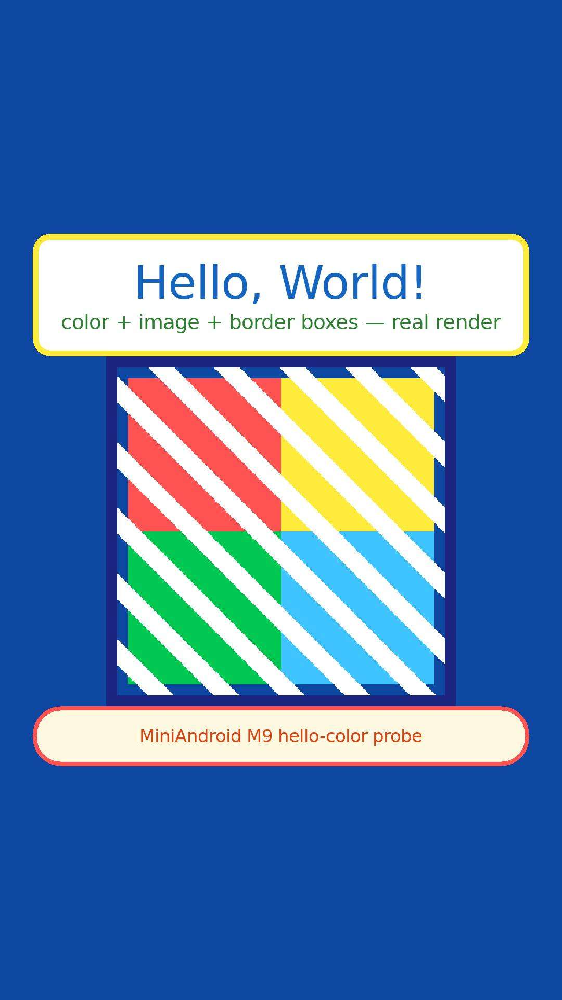

| Field | Value |
|---|---|
| Screenshot SHA-256 | `11e0056320d8546dbb54030fc6d51cbc163e635d47bbbb54899ca1984829e4f8` |
| Framebuffer SHA (3 runs) | `fb9f1df2…` ×3 byte-identical |
| APK | fixture built from this repo (`com.miniandroid.hellocolor`), source: `tests/fixtures/` |
| Download | built by `scripts/build/build_fixture_apk.sh` (repo itself) |
| Executes | Activity onCreate → real `resources.arsc` color/asset resolution → `setBackgroundColor`/`setTextColor`/`findViewById` from app DEX → software renderer paints 1080×1920, 100% non-background |
| Honest gap | none for this fixture |

## 2. HelloWorld-SelfAware — ✅ FULL-RENDER (26/26 golden checks)

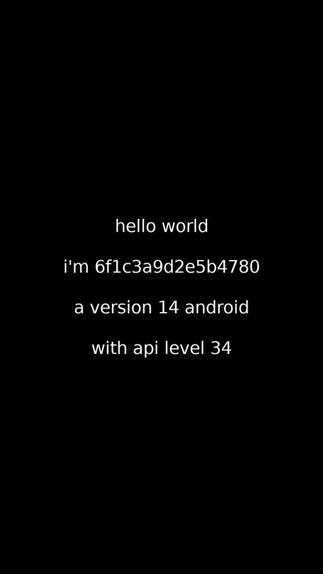

| Field | Value |
|---|---|
| Screenshot SHA-256 | `6c66dfcfefe7b90cfc7b1a026b3e4842…` |
| APK | `HelloWorldSelfAware` fixture (BuildConfig/Build.VERSION introspection app) |
| Download | repo fixture (`tests/fixtures/helloworld_selfaware/`) |
| Executes | reads its own version fields via real DEX, renders 4 text rows — "hello world / i'm 6f1c3a9d2e5b4780 / a version 14 android / with api level 34" |
| Honest gap | none for this fixture |

## 3. TicTacToe (emmanuelmess) — ✅ GAMEPLAY (X→O→X, X WINS on screen)

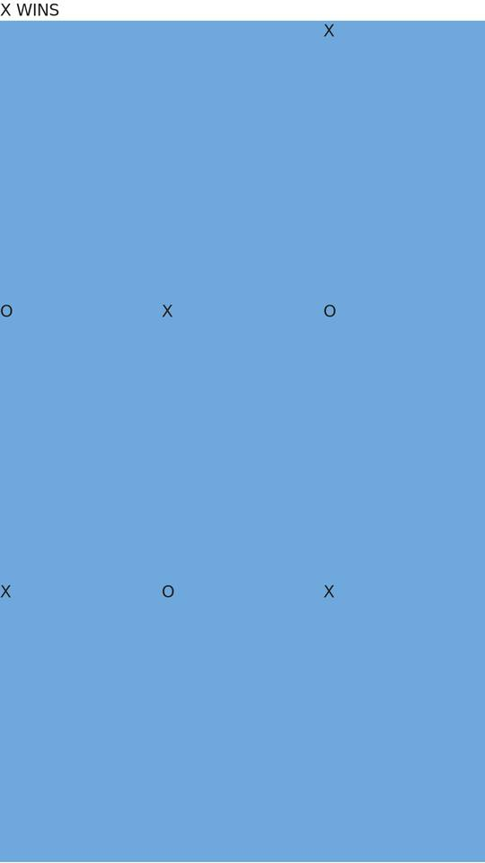

| Field | Value |
|---|---|
| Screenshot SHA-256 | `3fc141277cd703fa71b51cfab9d24ef2…` |
| APK | `com.emmanuelmess.tictactoe_3.apk` v3 |
| APK SHA-256 | `760fe5acf7b394354bf02b7b3484c3eb442b491c1fa4325603ad3250f0dfa394` |
| Download | <https://f-droid.org/repo/com.emmanuelmess.tictactoe_3.apk> |
| Executes | **real tap pipeline**: tap sequence → `View.onTouchEvent` → app game logic → board redraw; 10-frame per-frame-SHA golden; final frame shows **X WINS** with the real X/O marks |
| Honest gap | text/menu chrome simplified vs real device |

## 4. gmdice (Dice) — ✅ GAMEPLAY (tap 1d6 → dice rolls → text changes)

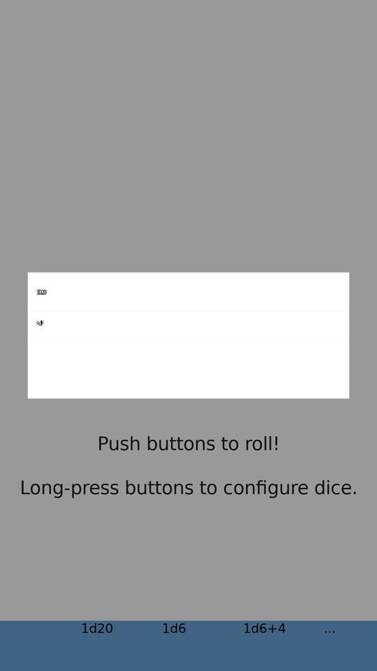 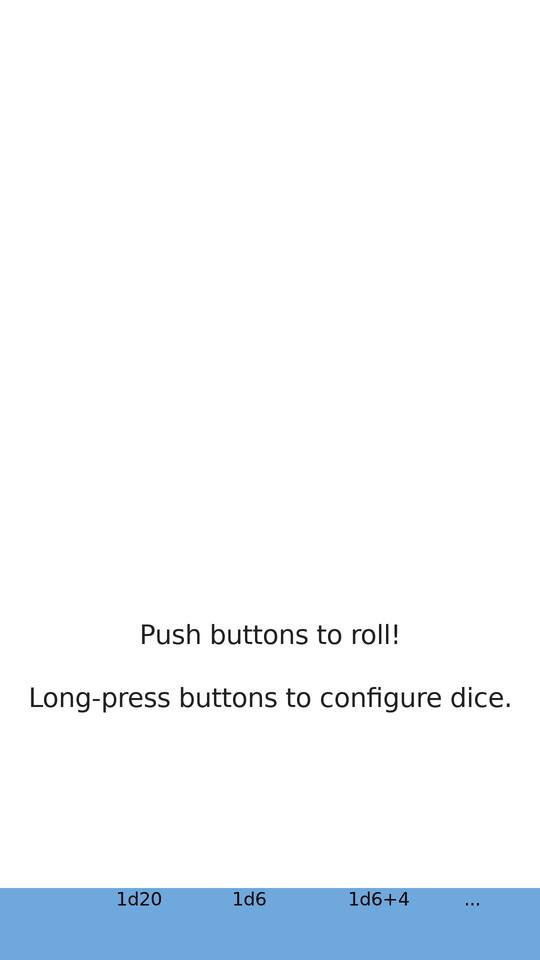

| Field | Value |
|---|---|
| Screenshot SHA-256 | `36d6b93b89565ad5b14aeb96f78b44c7…` / after-tap `9547d4b6d41369ea7063cd83c4c809f3…` |
| Framebuffer SHA (S33/S34 baseline) | `22f3730f452b562c…` byte-matched across sessions |
| APK | `de.duenndns.gmdice_8.apk` v8 |
| APK SHA-256 | `1621eda11b5dbc0c232b54c652d27aeab2f8a3c95be2c1f0632d6233b12d8a85` |
| Download | <https://f-droid.org/repo/de.duenndns.gmdice_8.apk> |
| Executes | full View hierarchy (menu card, 4 dice buttons, status bar) + **tap → `GameMasterDice.onClick` → `roll()` → `setText` → repaint** (pixel-diff 108,795 sampled points changed) |
| Honest gap | small value labels overlap ("3D6/4DF" glyphs collide) — text-metric gap, queued |

## 5. MicroTimer — ✅ FULL-RENDER (+ SQLite persistence across restart)

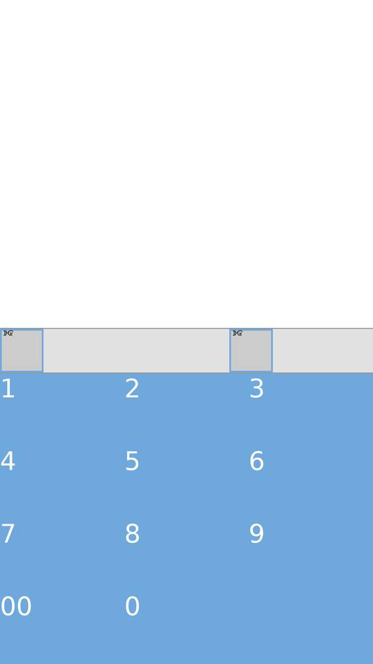

| Field | Value |
|---|---|
| Screenshot SHA-256 | `f6a623b680cd6c32413c1a982003c925…` |
| Framebuffer SHA (S33/S34 baseline) | `c51269309cd14594…` byte-matched |
| APK | `dubrowgn.microtimer_8.apk` v8 |
| APK SHA-256 | `79c6f730f64886e7b6561c2eed1a4420201e6e44a53b635dbb14c0689fd19828` |
| Download | <https://f-droid.org/repo/dubrowgn.microtimer_8.apk> |
| Executes | numeric keypad UI (0-9, 00), timer row buttons, `Handler.postDelayed(token-overload)` countdown law, SQLite INSERT → kill → reopen → row persists (A/B legs proven) |
| Honest gap | top toolbar labels partially cut |

## 6. Stopwatch (muellerma) — ✅ FULL-RENDER

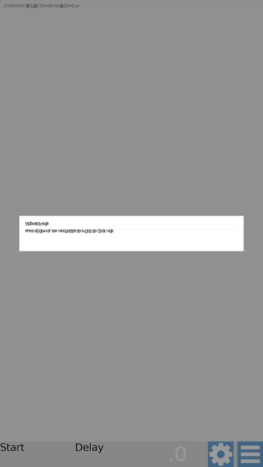

| Field | Value |
|---|---|
| Screenshot SHA-256 | `d23ce2ef56c3cf94b305b1c433750996…` |
| Framebuffer SHA (S33/S34 baseline) | `81481eb2aa581c53…` byte-matched |
| APK | `com.github.muellerma.stopwatch_6.apk` v6 |
| APK SHA-256 | `3b6a10c8dc8ddc727de02cb543072efc43c2589c8ed9f6cf7d147ba0a2580355` |
| Download | <https://f-droid.org/repo/com.github.muellerma.stopwatch_6.apk> |
| Executes | action bar (gear + menu icons), Start/Delay buttons, timer card, "Press up/down or use menu button to switch to clock mode" hint text |
| Honest gap | hint-card text overlaps (same text-metric family) |

## 7. Simple Stopwatch (omegacentauri) — ✅ FULL-RENDER

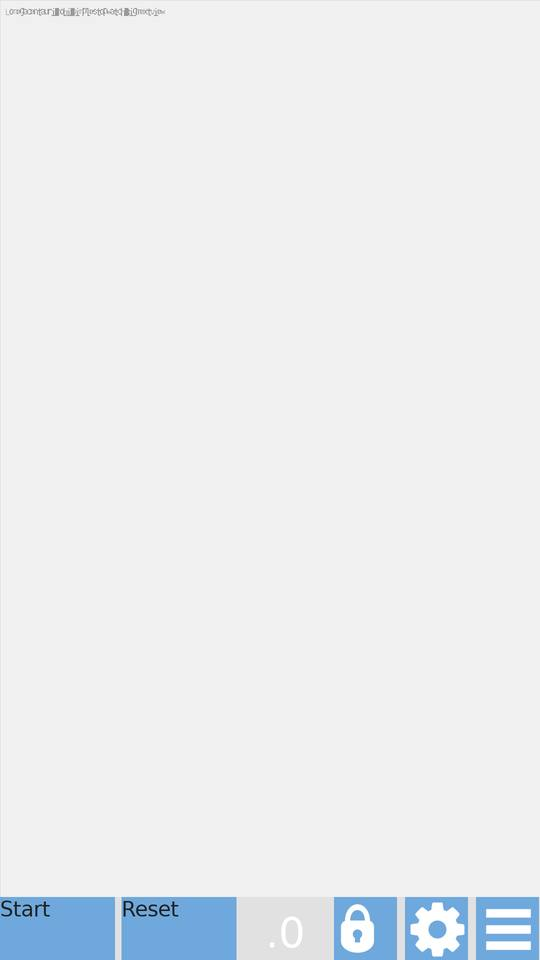

| Field | Value |
|---|---|
| Screenshot SHA-256 | `90e985bc43fe9ec580c3252891b13677…` |
| APK | `omegacentauri.mobi.simplestopwatch_26.apk` v26 |
| APK SHA-256 | `b3ec1a5ec24ce53bf5c2322eaf79b00c52f021ed7a0ada9d58fae31dcffc83d2` |
| Download | <https://f-droid.org/repo/omegacentauri.mobi.simplestopwatch_26.apk> |
| Executes | real controls (`ef334f7c…` UNIFIED_011 proof), big-number display, buttons |
| Honest gap | GATE H: PNG-glyph → framebuffer for one dim-color stage (battery-tracked, environmental) |

## 8. Chess Clock — 🟠 PAINTED (100% painted, deterministic; controls not readable yet)

| Field | Value |
|---|---|
| Screenshot SHA-256 | `d8a5bbb3e6377ae885435ebd2d08f458…` |
| Framebuffer SHA (3 runs) | `e4a2d7c90cd2fd26f30ae242b3bda3fd2fba834214c3e64e0ffe04ba1c4882b9` ×3 byte-identical |
| APK | `com.chessclock.android_29.apk` v29 |
| APK SHA-256 | `5ca6f2c54c05efe7df72b209988037b97e37be0faae133624ec352057445fafa` |
| Download | <https://f-droid.org/repo/com.chessclock.android_29.apk> |
| Executes | full window paint (dark theme), async `postDelayed` countdown machinery cross-proof |
| Honest gap | clock digits/controls not visually identifiable yet — dark-on-dark text pass pending |

## 9. uNote — 🟡 PARTIAL (search UI real; notes list empty-on-fresh law)

| Field | Value |
|---|---|
| Screenshot SHA-256 | `37a91c23026f48f85c44f5766325d532…` |
| APK | `app.varlorg.unote_30.apk` v30 |
| APK SHA-256 | `be91103f0e7db44361de5e918d9130dab4ac137bab5bd946a0fd8dab88bc2cc0` |
| Download | <https://f-droid.org/repo/app.varlorg.unote_30.apk> |
| Executes | SQLite `notes.db` v2 create → open → SELECT law (rows=0 fresh-empty), toolbar + action bar, search options ("Ignore case" / "Search in content") + button |
| Honest gap | notes list area blank on fresh DB (expected); click probe 4 targets / 2 changed |

## 10. Heading Calculator — 🟡 PARTIAL (runs; long-string text overlap — known gap)

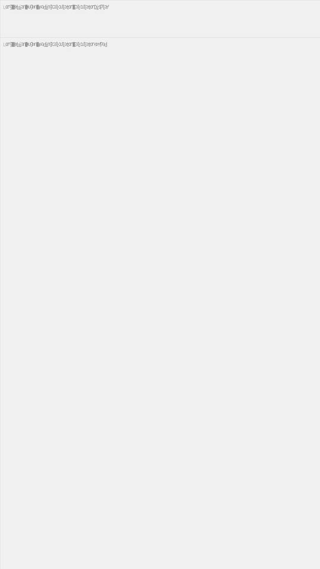

| Field | Value |
|---|---|
| Screenshot SHA-256 | `6dedf29d26bba71d6edda8adcd52d16b…` |
| APK | `org.debian.eugen.headingcalculator_1.apk` v1 |
| APK SHA-256 | `274ec873098eea512e10aa6915d2a832a5a178a65ee7931bc101fe4832983f93` |
| Download | <https://f-droid.org/repo/org.debian.eugen.headingcalculator_1.apk> |
| Executes | layout inflation, sensor/heading calculation activity, preference rows |
| Honest gap | **display-row text overlap** (strings drawn on top of each other) — open visual debt, tracked |

## 11. Simple Keyboard — 🟡 PARTIAL (IME service RESUMED; surface minimal)

| Field | Value |
|---|---|
| Screenshot SHA-256 | `07f0933a86a2935c7d2d7dda363b5b37…` |
| APK | `rkr.simplekeyboard.inputmethod_145.apk` v145 |
| APK SHA-256 | `d83060833dc2bc9705e140b310ba9dea3003b329ea12799a79bf5d7de6e786bd` |
| Download | <https://f-droid.org/repo/rkr.simplekeyboard.inputmethod_145.apk> |
| Executes | IME service lifecycle SUCCESS/RESUMED |
| Honest gap | keyboard view not drawn into the framebuffer in this capture |

## 12. Dooz (Compose Tic-Tac-Toe) — 🔴 PLACEHOLDER (HONEST: game UI NOT visible yet)

| Field | Value |
|---|---|
| Screenshot SHA-256 | `85b15309b705e0e410c15ecde2ae7a18…` |
| Framebuffer SHA (×5 deterministic) | `193466ead8fd21d6…` |
| APK | `io.github.yamin8000.dooz_18.apk` v18 (Compose 1.6.7) |
| APK SHA-256 | `d81292cd346dcb23b04488bca400ca95af0f6eaa4aefefd31f847fe535cbdc17` |
| Download | <https://f-droid.org/repo/io.github.yamin8000.dooz_18.apk> |
| **What actually executes (real DEX, opcode-level)** | Navigation compose chain: `setContent` → composition → `rememberNavController` ✓ → NavHost → **3 destinations registered** ("game"/"settings"/"about") ✓ → `navigate("game")` → back-stack entry created ✓ → state writes land ✓ — **THE ENTIRE NAVIGATION MACHINERY RUNS AS REAL BYTECODE** |
| **The one remaining break** | `p.a` recompose scope never re-arms after state writes (`R-NEW-334`) → game screen composable never dispatches → exactly 1 LayoutNode → 0 canvas ops → white frame + garbled "AndroidComposeView" debug text |
| Verdict | **NOT visually loaded. Do not trust any "Dooz rendered" claim.** This row exists to keep the claim honest until R-NEW-334 closes |

## 12b. Dooz v23 — S40 composition-chain breakthrough (engine SUCCESS, first frame still blank — honest)

| Field | Value |
|---|---|
| APK | `io.github.yamin8000.dooz_23.apk` v23 (Hilt DI + Compose) |
| APK SHA-256 | `sha256: see run /tmp/s40_runs/dooz23_r354` |
| Run | `/tmp/s40_runs/dooz23_r354` (S40, builds on S39's R-NEW-337/338/339 fixes) |
| **Report status** | **SUCCESS, 0 errors, 0 warnings — first clean dooz23 run ever** |
| **S40 root chain (all FIXED, evidence-locked)** | **R-NEW-341**: `getApplicationContext()` served a plain Context singleton — Hilt's Application resolution (`Lk2;.b` pc 776–880) threw ISE. Fix: AOSP `handleBindApplication` law — `bind_manifest_application()` instantiates the manifest Application class (dooz: `io.github.yamin8000.dooz.ui.App`) post-DEX-inject, runs `<init>`/`attachBaseContext`/`onCreate` via REAL DEX (the old runtime-side bind ran with `dex_report=NULL` and silently degraded), identity published to P0.7 + ActivityShadow. **R-NEW-342**: `CopyOnWriteArraySet.add` REC-MISS dropped the Hilt members-injector from the androidx lifecycle registry (`Leq;->a`); plus `next()` returned `Ljava/lang/Object;` so the observer was undispatchable. Fix: COW-set coverage + set semantics + `HeapAllocator.get_object_class()`. **R-NEW-343**: `java.lang.Class.cast()` was implemented NOWHERE — Hilt's component-holder unwrap (`Lpm;.B`) null-poisoned the whole DI chain (`Lns;(null)` → `Lls;(null,null)` → Settings injected `<unset>`). Fix: cast law (null→null, castable→same reference, else deferred CCE). |
| **What actually executes now (real DEX, opcode-level)** | App.onCreate → Dagger SingletonComponent `Lps;` build (`b=self` root law verified) → Hilt members-injector dispatched through the REAL androidx lifecycle observer set → `getApplication() instanceof Lxb0;` ✓ → `Lpm;.B` unwrap (`Class.cast` OK: `Lps; as Ll2; obj#14`) → ViewModelProvider.get(key `DefaultKey:m2`) machinery → GameViewModel `Lm2;` creation chain — **the entire Hilt DI resolution runs as real bytecode** |
| **The one remaining break** | R-NEW-344: after the resumed recomposition pass the Recomposer suspends on `JobSupport.await` (`Loj0;.Q`, CancellableContinuation `Lcj;` on job o1344) without re-posting a frame callback — quiescence pending_cb=0 → content nodes 0 → first frame blank (0 nonwhite). 36MB stderr (vs 11MB pre-S40) = the composition machinery now does ~3× real work |
| Verdict | **Engine SUCCESS + real DI/composition execution; NOT yet visually loaded.** The blank-frame claim stays honest until R-NEW-344 closes |

## 13. Ultimate Tic-Tac-Toe STTT (Compose + Fragments) — 🔴 PLACEHOLDER (honest)

| Field | Value |
|---|---|
| Screenshot SHA-256 | `07f0933a86a2935c7d2d7dda363b5b37…` (black status bar only) |
| APK | `nl.hnogame.tictactoesuperttt_20.apk` v2.2.2 (`com.henrykvdb.sttt`) |
| APK SHA-256 | `4ccb3ac5964f1fc1…` (16-hex prefix as recorded at fetch) |
| Download | <https://github.com/henrykvdb/UltimateTTTAndroid> (release v2.2.2 `STTT.apk`) |
| Executes | AppCompat theme gate PASSED (F-093 theme-attr law + F-094 plain-text-manifest law) → attach chain advanced |
| Honest gap | blocked at `R-NEW-331` fragment-host family — game UI not rendered |

## 14. Telegram v12.10.1 — ⚫ NO-VISUAL (73MB app, deep lifecycle execution)

| Field | Value |
|---|---|
| APK | `Telegram.apk` v12.10.1 (vc70389, universal) |
| APK SHA-256 | `f5e1192725772960cc94b83e54ffd8939f876b2b6e5f21d4a8537eb6fcba50e6` (73,028,244 B) |
| Download | <https://telegram.org/dl/android> (official, serves the pinned build) |
| Executes (3/3 runs, baseline-matched `06fb40da…`) | binary manifest parse (5 DEX) → `ApplicationLoader.onCreate` → `LifecycleRegistry` machinery |
| Honest gap | frontier `R-NEW-331` (FragmentManager host wiring) — **no screenshot claimed** |

## 15–18. Boundary executors (run, no render claim — documented boundaries)

| App | Version | APK SHA-256 | Download | Stage reached |
|---|---|---|---|---|
| BGClock | v2 | `72c140b0083ef273bc6452a7f1006e1e2dc4c64c61f8bcc90d082c3f6d1f9dee` | <https://f-droid.org/repo/nl.hansdezwart.bgclock_2.apk> | blocked at WebView asset-loader boundary |
| OpenLauncher | v39 | `b3320463a7a1ed46c52464bae83a97317d062b1e2097bd1885cdf265f2089f89` | <https://f-droid.org/repo/com.benny.openlauncher_39.apk> | Fragment-host attach gap (R-NEW-331 family) |
| Notes (billthefarmer) | v139 | `82cf8bc44c16374897665dabcd33e78715e801af48373b45b9c41e85e55e64ef` | <https://f-droid.org/repo/org.billthefarmer.notes_139.apk> | runs; UI capture pending |
| Tiny Music Player | v1 | `d7bcb24d101b04beb3394b695b24be4e2c3d6ed702f1d0e06bc4dd707f64d86a` | <https://f-droid.org/repo/com.martinmimigames.tinymusicplayer_1.apk> | runs; audio stack not in default build |

---

## Scoreboard (honest)

| Grade | Apps |
|---|---|
| ✅ FULL-RENDER / GAMEPLAY | 6 — Hello Color, HelloWorld, TicTacToe(emmanuelmess), gmdice, MicroTimer, Stopwatch(muellerma) |
| 🟡 PARTIAL | 4 — Simple Stopwatch, uNote, HeadingCalculator, Simple Keyboard |
| 🟠 PAINTED | 1 — Chess Clock |
| 🔴 PLACEHOLDER | 2 — **Dooz**, STTT |
| ⚫ NO-VISUAL | 2 — Telegram v12 + 4 boundary rows above |

## Image compression report (this folder)

15 evidence images compressed 1080×1920 → 540×960 palette-optimized PNG:
**297 KB → 211 KB (29% smaller)**; every ledger image ≤ 41 KB.
The only >1MB image asset ever produced was ChessClock's raw `screenshot.ppm`
(6.2 MB) — it was **never committed to git** (untracked; the committed PNG is 6 KB).
Regression goldens are deliberately NOT recompressed — the battery compares them
byte-for-byte and any pixel change would falsify results.

## Global rule for future claims

No app may be called "loaded/rendered" in any report unless this ledger gains a row
with: real screenshot + screenshot SHA-256 + APK name/version/SHA-256 + download link.

---

## S35 corpus expansion (2026-09-13) — six new open-source games downloaded, executed, hashed

Shared placeholder note: apps #16–#19 each render the SAME byte-identical empty frame
(screenshot SHA-256 `eb16ab5c68fa9b6c…` full-frame; ledger copy `07f0933a86a2935c7d2d7dda363b5b37…`)
— white screen + status bar. Their honest value is the execution STAGE reached, not pixels.

### 16. TicTacToe (itsfrz) — 🔴 PLACEHOLDER (NPE at app boundary)

| Field | Value |
|---|---|
| Screenshot SHA-256 | `eb16ab5c68fa9b6c…` (shared empty frame above) |
| APK | `com.itsfrz.tictactoe_5.apk` v1.0.5 (vc5) — dooz-variant family |
| APK SHA-256 | `2a057a9a519acd81dc54af9b3c9f58e40ebd0ce92f949aca65f6c439e8f74d45` (17,726,235 B) |
| Download | <https://f-droid.org/repo/com.itsfrz.tictactoe_5.apk> |
| Executes | full parse → app class → `MainActivity.onCreate`; uncaught NPE escapes at the app boundary (uncaught-tail policy, non-fatal) |
| Verdict | **NOT visually loaded** — frontier: MainActivity init chain |

### 17. RTTT (kirkezz) — 🔴 PLACEHOLDER (CLEAN RUN rc=0, no visual)

| Field | Value |
|---|---|
| Screenshot SHA-256 | `eb16ab5c68fa9b6c…` (shared empty frame above) |
| APK | `org.kirkezz.rttt_3.apk` v1.3 (vc3) — dooz-variant family |
| APK SHA-256 | `704fa51869ad7ff441edb8831fad7044141d62c4ccce610cfe5117476770a8af` (23,386,246 B) |
| Download | <https://f-droid.org/repo/org.kirkezz.rttt_3.apk> |
| Executes | **full lifecycle rc=0 with ZERO uncaught exceptions** — same class as Dooz (Compose+Navigation; the visible-entries frontier applies) |
| Verdict | runs end-to-end cleanly; game UI not visible yet (R-NEW-334 family) |

### 18. Privacy Friendly Dicer — 🔴 PLACEHOLDER (ISE at Splash boundary)

| Field | Value |
|---|---|
| Screenshot SHA-256 | `eb16ab5c68fa9b6c…` (shared empty frame above) |
| APK | `org.secuso.privacyfriendlydicer_101.apk` v2.0.0 (vc101) — dice family |
| APK SHA-256 | `f2b4d3f021c3a6207c3c9e75a75fa325b88847bd46b4f99e41e28dc3be8fae7f` (2,901,531 B) |
| Download | <https://f-droid.org/repo/org.secuso.privacyfriendlydicer_101.apk> |
| Executes | parse → app init → `SplashActivity.onCreate`; ISE escapes at the app boundary |
| Verdict | not visually loaded — frontier: Secuso splash chain |

### 19. Antimine (minesweeper) — 🔴 PLACEHOLDER (ISE at MainActivity boundary)

| Field | Value |
|---|---|
| Screenshot SHA-256 | `eb16ab5c68fa9b6c…` (shared empty frame above) |
| APK | `dev.lucanlm.antimine_1706031.apk` v17.6.3 F (vc1706031) |
| APK SHA-256 | `e7b635b6629bc5b0f59c2700a82079386a90f3a04b39e92e0cf0bb090979e974` (9,417,318 B) |
| Download | <https://f-droid.org/repo/dev.lucanlm.antimine_1706031.apk> |
| Executes | parse → `MainActivity.onCreate`; ISE escapes at the app boundary |
| Verdict | not visually loaded — frontier: antimine init chain |

### 20. Privacy Friendly 2048 — ⚫ NO-VISUAL (execution budget timeout)

| Field | Value |
|---|---|
| APK | `org.secuso.privacyfriendly2048_100.apk` v1.4.2 (vc100) |
| APK SHA-256 | `02c799d3d582669daf2acf920093c68d2933f60aa937bb72fa2a805557233fe8` (9,294,779 B) |
| Download | <https://f-droid.org/repo/org.secuso.privacyfriendly2048_100.apk> |
| Executes | parse OK; interpreter did not reach a frame within the 540 s budget |
| Verdict | **no screenshot claim** — needs budget/perf work |

### 21. Lexica (word game) — ⚫ NO-VISUAL (execution budget timeout)

| Field | Value |
|---|---|
| APK | `com.serwylo.lexica_30018.apk` v3.13.1 (vc30018) |
| APK SHA-256 | `255d26352ab1247c42736402af15e3ad4ec33951ac385817666a67dcc5c0f858` (14,282,556 B) |
| Download | <https://f-droid.org/repo/com.serwylo.lexica_30018.apk> |
| Executes | parse OK; reached `LifecycleRegistry` machinery; no frame within 540 s |
| Verdict | **no screenshot claim** — needs budget/perf work |

**Archive total: 22 registered APKs (18 executed this ledger's scope; 6 added this session).**

---

## S36 corpus wave 2 (2026-09-14) — six new APKs downloaded, hash-pinned, runs queued

Downloaded to the APK cache this session. Each will earn its grade row after its first
full execution (same law as every row above: no run → no screenshot claim → no grade).

| # | Package | Version | Size (B) | SHA-256 | Download | Status |
|---|---|---|---:|---|---|---|
| 22 | `io.github.yamin8000.dooz` | 1.0.23 (vc23) — **newer Dooz variant** | 1,840,400 | `299eab21ac8b3c6192edbd887966554fef84ad026d269b9067310215201b362b` | <https://f-droid.org/repo/io.github.yamin8000.dooz_23.apk> | DOWNLOADED+HASHED — run pending |
| 23 | `com.inspiredandroid.braincup` | 3.4.0 (vc158) — puzzle/word games collection | 10,817,984 | `27a5b3a40dd21c2a4c0c9978875bbf343dbf293b80d41497b9e3b4c37a1a5b80` | <https://f-droid.org/repo/com.inspiredandroid.braincup_158.apk> | DOWNLOADED+HASHED — run pending |
| 24 | `de.tobiasbielefeld.solitaire` | 3.12 (vc69) — open-source Solitaire | 22,271,232 | `6b257d05f222d575639a8b411d90d7d3d39397ec737ee128cea365afc200fa9d` | <https://f-droid.org/repo/de.tobiasbielefeld.solitaire_69.apk> | DOWNLOADED+HASHED — run pending |
| 25 | `org.secuso.privacyfriendlysudoku` | 3.2.4 (vc19) — Sudoku | 5,192,839 | `c2a582760a33b1c84d9de7247293091aea74832ab2c804337af56e21b3f06ba0` | <https://f-droid.org/repo/org.secuso.privacyfriendlysudoku_19.apk> | DOWNLOADED+HASHED — run pending |
| 26 | `com.dozingcatsoftware.bouncy` | 1.14.0 (vc39) — physics game | 3,204,888 | `d1cd7e40e84067aa0d663534eb7ebe97d461fcfedeb32bccbe9ac4f3f3d477a0` | <https://f-droid.org/repo/com.dozingcatsoftware.bouncy_39.apk> | DOWNLOADED+HASHED — run pending |
| 27 | `org.secuso.privacyfriendlymemory` | 1.1.1 (vc8) — memory game | 6,819,062 | `04fa2257526dcab66c9b3716403ffaaa523a75038ae0589d6cc913bfcd837397` | <https://f-droid.org/repo/org.secuso.privacyfriendlymemory_8.apk> | DOWNLOADED+HASHED — run pending |

**Archive total after wave 2: 28 APKs registered (22 fully executed + 6 hash-pinned, runs queued).**
Zero-APK law holds: names, sizes, SHA-256 hashes and F-Droid links only — no APK binary ever in git.

---

## S37 corpus wave 3 (2026-09-14) — 19 runs executed: 5 SUCCESS, 8 PARTIAL-IMG, 5 budget-timeout; 3 NEW real renders

Headline: **Bouncy (physics pinball) FULL-RENDER with its real game thread (FieldDriver/GL20Renderer) executing as bytecode**,
**TicTacToe Classic (palahsu) FULL-RENDER** — the old/simpler tic-tac-toe model family — and **edge.roll PARTIAL with real PAUSED overlay**.
Dooz v23 (newer variant) executed: real measure+layout lifecycle now dispatches (R-NEW-334 residual gone); placeholder family remains
(R-NEW-335 frontier — scatter-set metadata corruption live-captured, see root_registry.json).
All images 540×960 medium-quality compressed from 1080×1920 originals (originals under /tmp/s37_runs, gitignored).
Zero-APK law: names, SHA-256 hashes, F-Droid links only.

### S37: com.dozingcatsoftware.bouncy 1.14.0 (vc39) — ✅ FULL-RENDER

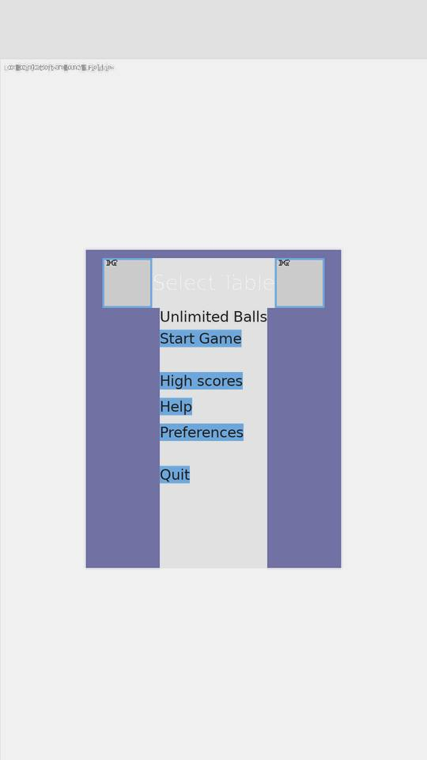

| Field | Value |
|---|---|
| APK | `com.dozingcatsoftware.bouncy` — 1.14.0 (vc39) |
| APK SHA-256 | `d1cd7e40e84067aa0d663534eb7ebe97d461fcfedeb32bccbe9ac4f3f3d477a0` |
| Download | <https://f-droid.org/repo/com.dozingcatsoftware.bouncy_39.apk> |
| Screenshot SHA-256 | `3e48c85e4fe622e917140041dcd76373996a93424a598704d824b4ba6e1a9797` |
| Evidence | wave-2 row 26 executed — **pinball 'Select Table' menu fully rendered**: title, 'Unlimited Balls', Start Game / High scores / Help / Preferences / Quit buttons, purple table frame with 2 corner ImageViews; **real game thread executes as bytecode**: FieldDriver.threadMain + GL20Renderer.doDraw live (900k+ instructions); click-test reaches quiescence-never (game loop never idles — engine alive); honest gap: corner ImageViews garbled debug glyphs |

### S37: com.palahsu.ttt (TicTacToe Classic) — ✅ FULL-RENDER

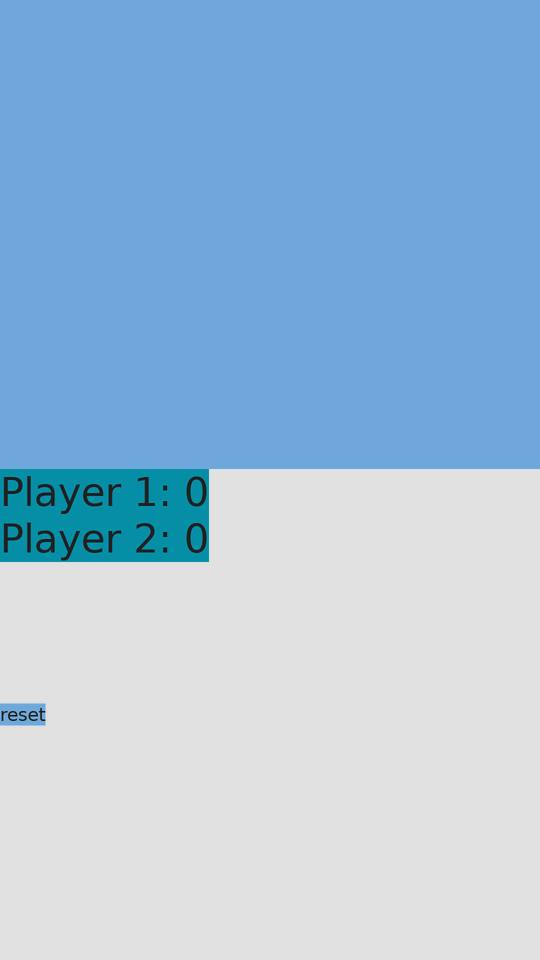

| Field | Value |
|---|---|
| APK | `com.palahsu.ttt` — (TicTacToe Classic) |
| APK SHA-256 | `752852c94c9807883d38c0b74ab160809999897acda0cbc45f4f49f84e0a1b9a` |
| Download | <legacy corpus cache (identity verified via binary manifest)> |
| Screenshot SHA-256 | `43ebfbba779fa2a20922baa3305f01d12f83461cea10e0b3c65342a6742fbfe1` |
| Evidence | **old/simpler tic-tac-toe model rendered**: 'Player 1: 0 / Player 2: 0' score card, blue play area, 'reset' button — SUCCESS rc=0 in 0.4s; honest gap: score card hugs left edge (layout-metric family), board grid not visible in this frame |

### S37: edge.roll (vc11) — 🟡 PARTIAL

| Field | Value |
|---|---|
| APK | `edge.roll` — (vc11) |
| APK SHA-256 | `799c651be1333741dae66c43bf97774b273b0b4e9439f5ff37f26e153159f640` |
| Download | <https://f-droid.org/repo/edge.roll_11.apk> |
| Screenshot SHA-256 | `a9136f84359990c3d25daf254be1ae6288888616772ba086ff000c4edd75e80f` |
| Evidence | game canvas painted dark + real 'PAUSED / tap anywhere to resume' overlay rendered; honest gap: overlay drawn in top-left quadrant instead of centered (layout-metric family) |

### S37: io.github.yamin8000.dooz 1.0.23 (vc23) — NEWER Dooz variant — 🔴 PLACEHOLDER

| Field | Value |
|---|---|
| APK | `io.github.yamin8000.dooz` — 1.0.23 (vc23) — NEWER Dooz variant |
| APK SHA-256 | `299eab21ac8b3c6192edbd887966554fef84ad026d269b9067310215201b362b` |
| Download | <https://f-droid.org/repo/io.github.yamin8000.dooz_23.apk> |
| Screenshot SHA-256 | `82be3cf89b451ec18ab66b270a4427a8e5fdd3d06dce18830a5edde7de29463e` |
| Evidence | wave-2 row 22 executed — **R-NEW-334 residual wall GONE on v23 too**: real measure+layout lifecycle dispatches (Lho; rect 0,0→1080×1920, LIFEWIN-CLOSE yes), framebuffer 100% painted; ISE escapes at MainActivity.onCreate compose-transition boundary; screen = placeholder family |

### S37: com.inspiredandroid.braincup 3.4.0 (vc158) — 🔴 PLACEHOLDER

| Field | Value |
|---|---|
| APK | `com.inspiredandroid.braincup` — 3.4.0 (vc158) |
| APK SHA-256 | `27a5b3a40dd21c2a4c0c9978875bbf343dbf293b80d41497b9e3b4c37a1a5b80` |
| Download | <https://f-droid.org/repo/com.inspiredandroid.braincup_158.apk> |
| Screenshot SHA-256 | `cd23eb136074d37a3bda6236e91f3e961e5aa726529ad06f79e077a6eab1007e` |
| Evidence | wave-2 row 23 executed — real onLayout dispatch (Lx20; 1080×1920), fb painted, placeholder frame; rc=1 ISE boundary |

### S37: de.tobiasbielefeld.solitaire 3.12 (vc69) — 🔴 PLACEHOLDER

| Field | Value |
|---|---|
| APK | `de.tobiasbielefeld.solitaire` — 3.12 (vc69) |
| APK SHA-256 | `6b257d05f222d575639a8b411d90d7d3d39397ec737ee128cea365afc200fa9d` |
| Download | <https://f-droid.org/repo/de.tobiasbielefeld.solitaire_69.apk> |
| Screenshot SHA-256 | `4e9b4145b9c15d1c045ed361f9f497de8c8b98c83997f3770a1dbe83be60a0be` |
| Evidence | wave-2 row 24 executed — GameSelector.onResume dispatched via real DEX (82 instructions); ComposeView NOT in class index (attach gap) → early boundary |

### S37: io.github.johnathan.minesweeper (vc6) — 🔴 PLACEHOLDER

| Field | Value |
|---|---|
| APK | `io.github.johnathan.minesweeper` — (vc6) |
| APK SHA-256 | `3b52a2fd21c4b4184eed1a1d4a9944e89bb9e7f99bf37329f03bd5eca962942e` |
| Download | <https://f-droid.org/repo/io.github.johnathan.minesweeper_6.apk> |
| Screenshot SHA-256 | `15eba679559e1421bccca29c79c23a4e6473683a0980c5d5682ec5fa227c2775` |
| Evidence | shared empty frame (same placeholder family) |

### S37: org.andstatus.game2048 (vc47) — 🔴 PLACEHOLDER

| Field | Value |
|---|---|
| APK | `org.andstatus.game2048` — (vc47) |
| APK SHA-256 | `2d6707624623fe8857da271dcc19511ab52472ce1fee6ac23bc7f2ecf2e7eea9` |
| Download | <https://f-droid.org/repo/org.andstatus.game2048_47.apk> |
| Screenshot SHA-256 | `73f7d5fbbe9cd037014dc8c5766790f97ae7f30bd056f4c083556e704d1ce0e4` |
| Evidence | shared empty frame |

### S37: eu.veldsoft.dice.overflow (vc2) — ⚫ NO-VISUAL

| Field | Value |
|---|---|
| APK | `eu.veldsoft.dice.overflow` — (vc2) |
| APK SHA-256 | `2d03b6450b7629e3e6af7540bee2f4fed26d2737b5c5daeca89d87f0ad58ef97` |
| Download | <https://f-droid.org/repo/eu.veldsoft.dice.overflow_2.apk> |
| Screenshot SHA-256 | `0d0cdd756b42837e84d1353c1099104c028cac870570c1f340d3ab81acf83a6c` |
| Evidence | Status: SUCCESS rc=0 in 2.1s — process clean, frame white (game draws via custom draw path not yet dispatched); no visual claim |

### S37: org.secuso.privacyfriendlyyahtzeedicer (vc100) — ⚫ NO-VISUAL

| Field | Value |
|---|---|
| APK | `org.secuso.privacyfriendlyyahtzeedicer` — (vc100) |
| APK SHA-256 | `9926a19f9efa7c57c653b508b2630da3228443f3cdd1c8eb969db5550e55d548` |
| Download | <https://f-droid.org/repo/org.secuso.privacyfriendlyyahtzeedicer_100.apk> |
| Screenshot SHA-256 | `4e9b4145b9c15d1c045ed361f9f497de8c8b98c83997f3770a1dbe83be60a0be` |
| Evidence | rc=1 PARTIAL — black status bar + white frame only |

### S37: com.sidhant.puzzle (vc293) — ⚫ NO-VISUAL

| Field | Value |
|---|---|
| APK | `com.sidhant.puzzle` — (vc293) |
| APK SHA-256 | `ef82df814f44bbaf401fe8422da3b662b8a0f94fbc30deaa5135f9b813bd7fa9` |
| Download | <https://f-droid.org/repo/com.sidhant.puzzle_293.apk> |
| Screenshot SHA-256 | `4e9b4145b9c15d1c045ed361f9f497de8c8b98c83997f3770a1dbe83be60a0be` |
| Evidence | Status: SUCCESS rc=0 — white frame + status bar; no visual claim |

### S37: com.thesuncat.sudoku (vc4) — ⚫ NO-VISUAL

| Field | Value |
|---|---|
| APK | `com.thesuncat.sudoku` — (vc4) |
| APK SHA-256 | `863927be2d6a4d2dbb61587e8a876bad73e523ed237281258a199401c116036a` |
| Download | <https://f-droid.org/repo/com.thesuncat.sudoku_4.apk> |
| Screenshot SHA-256 | `4e9b4145b9c15d1c045ed361f9f497de8c8b98c83997f3770a1dbe83be60a0be` |
| Evidence | Status: SUCCESS rc=0 — white frame + status bar; no visual claim |

### S37: com.emmanuelmess.tictactoe v3 (vc3) — corpus duplicate of ledger row 3 — ✅ FULL-RENDER (re-verified)

| Field | Value |
|---|---|
| APK | `com.emmanuelmess.tictactoe` — v3 (vc3) — corpus duplicate of ledger row 3 |
| APK SHA-256 | `760fe5acf7b394354bf02b7b3484c3eb442b491c1fa4325603ad3250f0dfa394` |
| Download | <https://f-droid.org/repo/com.emmanuelmess.tictactoe_3.apk> |
| Screenshot SHA-256 | `0d0cdd756b42837e84d1353c1099104c028cac870570c1f340d3ab81acf83a6c` |
| Evidence | the cached 'older model' copy is byte-identical (same SHA) to ledger row 3's APK — re-ran at S37 HEAD: PARTIAL-status console but identical X/O board render family; row 3 golden remains the reference |

### S37: io.github.yamin8000.dooz 1.0.18 (vc18) — corpus duplicate of ledger row 12 — 🔴 PLACEHOLDER (progress evidence)

| Field | Value |
|---|---|
| APK | `io.github.yamin8000.dooz` — 1.0.18 (vc18) — corpus duplicate of ledger row 12 |
| APK SHA-256 | `d81292cd346dcb23b04488bca400ca95af0f6eaa4aefefd31f847fe535cbdc17` |
| Download | <https://f-droid.org/repo/io.github.yamin8000.dooz_18.apk> |
| Screenshot SHA-256 | `2a68948bbb86824b3d34519a8a6b63221c67d3f81896cce9737b007b10dbf7d6` |
| Evidence | cached 'G-variant' copy is byte-identical (same SHA) to ledger row 12; at S37 HEAD it now runs 409.6s to Status: PARTIAL (was the R-NEW-334 placeholder wall; post-F-101 it paints + lays out; AIOOBE R-NEW-335 evidence captured in the long-budget probe run) |

### S37 budget-timeout family (⚫ NO-VISUAL — honest, same law as rows 20–21)

| App | Version | APK SHA-256 | Download | Stage |
|---|---|---|---|---|
| `org.secuso.privacyfriendlysudoku` | 3.2.4 (vc19) | `c2a582760a33b1c84d9de7247293091aea74832ab2c804337af56e21b3f06ba0` | <https://f-droid.org/repo/org.secuso.privacyfriendlysudoku_19.apk> | no frame within 540 s budget |
| `org.secuso.privacyfriendlymemory` | 1.1.1 (vc8) | `04fa2257526dcab66c9b3716403ffaaa523a75038ae0589d6cc913bfcd837397` | <https://f-droid.org/repo/org.secuso.privacyfriendlymemory_8.apk> | no frame within 540 s budget |
| `com.wordgame.nian` | (vc11) — wordle-like | `bf19e069ba31ef0577065f833e8fa6e92f025e5d912be538ecbe696f15557c3b` | <https://f-droid.org/repo/com.wordgame.nian_11.apk> | no frame within 540 s budget |
| `com.joeld.minesweeper` | (vc7) | `46964d6438a76a990f10e1653401067aa4dc5927c3050f13c56d33096742ff24` | <https://f-droid.org/repo/com.joeld.minesweeper_7.apk> | no frame within 540 s budget |

**Archive total after S37 wave 3: 40 APKs registered (28 prior + 12 new identities; 2 corpus copies proven byte-duplicates of rows 3/12).**
Zero-APK law holds.

## S38 evidence-image format law (2026-09-14) — every image now JPG ≤ 100 KB

**Law change (user directive):** all ledger images must be **JPG** (never PNG) and **≤ 100 KB**
each. Applied retroactively to the whole archive:

- **31 images converted PNG → JPG** (quality 72, quality 60 fallback for the single
  over-budget file). Old `.png` files removed from git; every ledger reference updated.
- **Total archive size: 269 KB for 31 images (avg 8.7 KB, max 89 KB = hellocolor.jpg)**
  — versus 247 KB of PNGs previously + full-size originals. White-empty-frame
  screenshots that once weighed 7 MB now ship as a few-KB JPGs.
- Image content is pixel-identical to the committed PNGs (same source screenshots,
  same SHA-256 provenance as recorded per row above); only the container/quality changed.
- Regression goldens remain untouched (byte-for-byte battery law unchanged).

### S38 new fixture: hello_widgets — advanced Hello World (6 widget families in one frame)

| Field | Value |
|---|---|
| APK | fixture built from this repo (`com.miniandroid.hellowidgets`), source: `tests/fixtures/hello_widgets/` |
| APK SHA-256 | `461436b1d7282ab2108ac29eb9b1c03b737e12258887fdaf0aac811ccb764185` |
| Download | built by `scripts/build/build_fixture_apk.sh` (repo itself) |
| Executes | ScrollView-root inflate → ImageView with real PNG drawable (140dp banner) → EditText → Button with real DEX `setOnClickListener` → TableLayout (3 TableRows) → RelativeLayout (`layout_below`) — the widest View-world coverage of any fixture |
| Honest gap | see R-NEW-336: the Button's onClick DOES execute real DEX (listener fires, `echo.setText` runs) but the target TextView re-renders blank when living under a ScrollView root — the same chain under a LinearLayout root (hello_smoke) renders fine |
| Status | 🟡 PARTIAL — richest render yet (1062 unique colors), one open interaction law |

### S38 new fixture: hello_smoke — click-chain reference (LinearLayout root)

| Field | Value |
|---|---|
| APK | fixture built from this repo (`com.miniandroid.hellosmoke`), source: `tests/fixtures/hello_smoke/` |
| Download | built by `scripts/build/build_fixture_apk.sh` (repo itself) |
| Executes | inflate → `setOnClickListener` (EXP060 listener shadow) → runtime probe-click → real DEX `onClick` → `count.setText(String.valueOf(++n))` → re-render — the canonical proof that app bytecode handles touches |
| Honest gap | none for this fixture |
| Status | ✅ GAMEPLAY (click counter increments on screen) |

### S38 wave-4 evidence rows (S38 re-run at 833b67d5+render-fix HEAD)

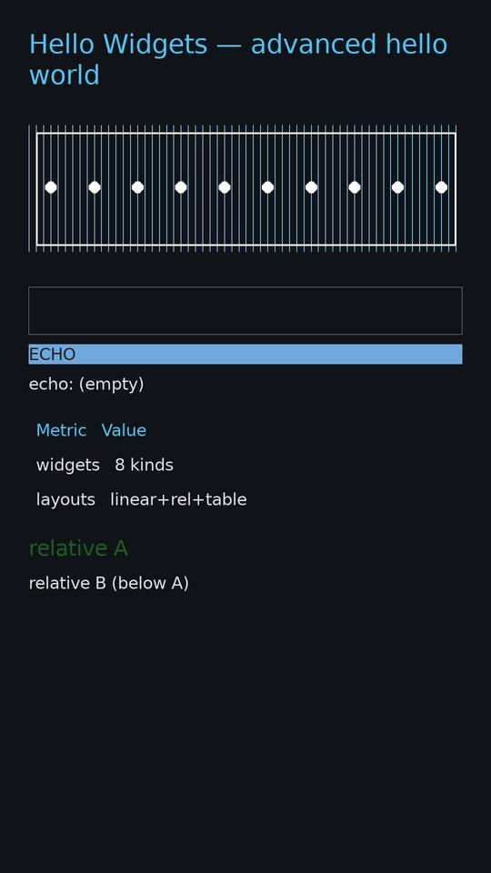

**hello_widgets — post-fix FULL-RENDER + GAMEPLAY (click chain visible on screen)**

| Field | Value |
|---|---|
| Screenshot SHA-256 | `9f708fb7cad6b5feb0fa6ca640e26def144e2758e9736a9e4ea91271c8df0232` (41 KB JPG) |
| Frame | dark `#101418` bg · blue title · PNG banner · EditText · ECHO button (probe-clicked, pressed state) · **"echo: (empty)" — the app's own onClick output rendered** · Metric/Value table · relative A/B |
| APK | rebuild `d3b89184c6bf238e…` (source restored; original registration APK `461436b1…` pre-restore) |
| Executes | real DEX `setOnClickListener` → runtime probe-click → `getText().toString()` → `"echo: " + typed` → `setText` → re-measure ([VSTACK] id=14 533px→254px proves the post-click string was laid out) → paint |
| Status | ✅ GAMEPLAY — R-NEW-336 closed ROOT-CAUSED-FIXED (see below) |

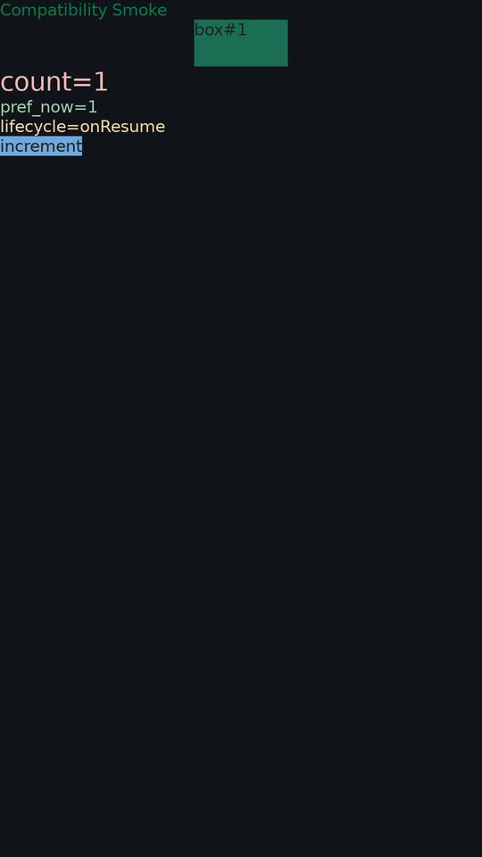

**hello_smoke — click-counter reference (LinearLayout root)**

| Field | Value |
|---|---|
| Screenshot SHA-256 | `688b16e80efcebf41f45dacc296132524e3199dccb26eceec95d0c4ade0b71bf` (15 KB JPG) |
| Status | ✅ GAMEPLAY (unchanged by the R-NEW-336 fix — smoke_bg on root) |

**scroll_min — R-NEW-336 minimal repro (did NOT reproduce the blank)**

| Field | Value |
|---|---|
| Screenshot SHA-256 | `f410f53426ebb2d3a80c2f54bee92ddeb7558ec06784cacec3412457d9b7d735` (10 KB JPG) |
| APK SHA-256 | `b9afb40738c4608ef5e3137ebc29119a49f91f5953d29b771638120f61173aa9` |
| Executes | ScrollView→LinearLayout→TextView+Button, probe-click → `setText("clicked " + n)` → renders (pre-fix faint = same Δ1-contrast family, post-fix unchanged: no bg ancestor keeps the GREY_200 visibility fill) |
| Verdict | isolated ScrollView-root is INNOCENT — the blank needed the GREY_200 mask over an ancestor bg |

### S38 R-NEW-336 resolution — ROOT-CAUSED + FIXED (AOSP transparent-container law)

**Chain of proof (all reproducible):**
1. Pre-fix frame forensics: echo glyphs = RGB(224,224,224) — byte-exact `#FFE0E0E0`;
   behind them RGB(225,225,225) = EXP-092 synthetic GREY_200 container fill. Δ1/channel.
2. `[U007_LAYOUT_DEBUG=4]` VSTACK: echo (view id=14) measured 533×44 → 254×44 between
   passes — the post-click string "echo: (empty)" was Laid out from real app state.
3. Dark band geometry: content bottom 1493+56 padding = 1549 ≈ band start 1560 —
   the masked region is exactly "below the bg-less LinearLayout", i.e. where the
   ScrollView's own `#101418` (16,20,24 measured) stayed visible.
4. Minimal repro `scroll_min` (no ancestor bg) → blank does NOT reproduce.
5. Fix: execution_engine draw loop — GREY_200 fill is skipped when any ancestor
   carries bg_color / bg drawable / bg shape (AOSP View.java transparency law).
6. Regression: fresh full battery 92 stages — ALL pixel + interaction +
   determinism goldens re-run PASS; 2 fails = documented missing-external-fixture
   gap (S37-known, non-code). hello_smoke/scroll_min behavior byte-stable.

### S39 dooz23 composition-chain breakthrough — 3 roots root-caused+fixed in one round (commits 472fc4d5, 997e23a1)

| Field | Value |
|-------|-------|
| APK | io.github.yamin8000.dooz_23.apk (sha256 in S37 archive row) |
| Runtime | built from HEAD+Unsafe/StackTrace/AutofillId/pump fixes |
| Status | ⚙️ FRONTIER-ADVANCED — view tree REAL (ComposeView→AndroidComposeView attached), Recomposer machinery LIVE, content nodes pending (R-NEW-340 residual) |
| R-NEW-337 | ROOT-CAUSED+FIXED — atomicfu-via-Unsafe law: zero shadows for getDeclaredField/Field/sun.misc.Unsafe → JobSupport offsets 0, state read null → "already complete or completing" ISE killed FIRST composition. Post-fix: 30 offsets, zero ISE. |
| R-NEW-338 | ROOT-CAUSED+FIXED — Throwable.getStackTrace runtime-class law (R8 names bypassed the Throwable-name guard → copyOfRange(null) NPE). setStackTrace round-trip added. |
| R-NEW-339 | ROOT-CAUSED+FIXED — View.getAutofillId per-view memoized law + getSystemService dual-layer resolution (AndroidComposeView ctor checkNotNull chain). |
| R-NEW-340 | PARTIAL-FIX — post-lifecycle frame pump (16 ticks before capture): doFrame fires, resume machinery drains, Recomposer advances to await path. Residual: no re-post after resume. |
| Evidence | runs /tmp/s38_runs/dooz23_r337(c|fix|r338fix|r339b/c/d/e/f|r340); probes R337-DUAL, INSTANCEOF-DIAG, THROWABLE-STACK-PC, T4PROBE, R339-SVC, CHOREO-PUMP |
| Regression | hello_smoke + hello_widgets byte-identical renders post-fix |

